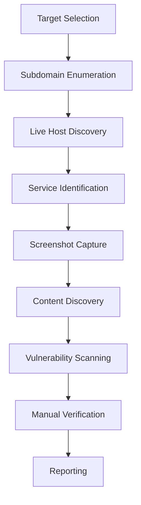
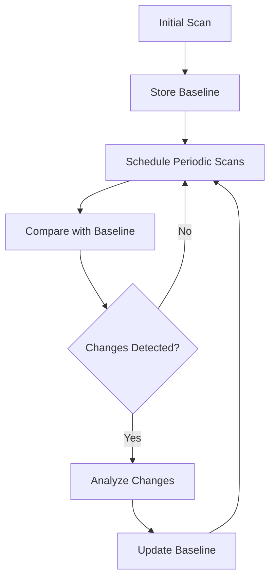
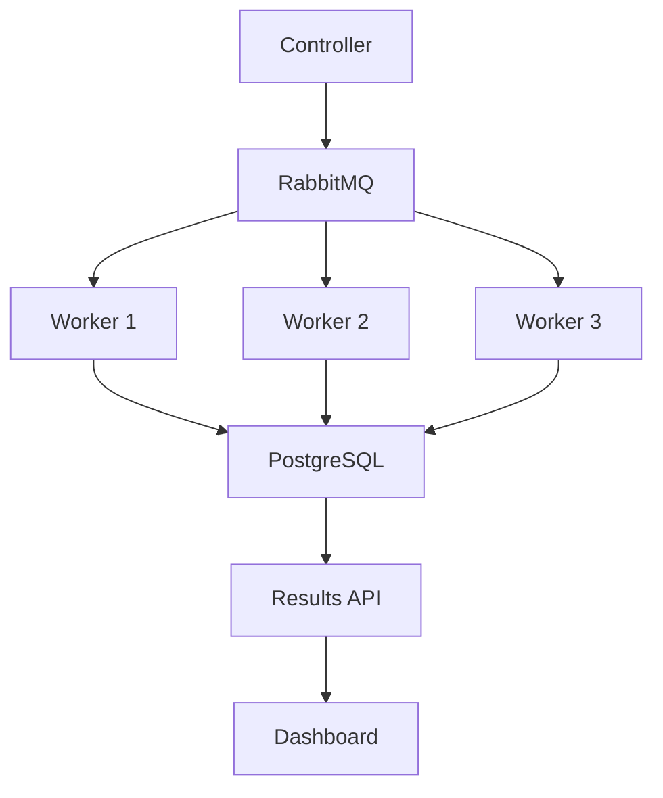

# Bug Bounty Automation Framework (2024)

This document outlines the latest tools, frameworks, and integration approaches for automating bug bounty hunting workflows in 2024.

## Table of Contents

- [Key Automation Tools](#key-automation-tools)
- [Integration Guides](#integration-guides)
- [Workflow Templates](#workflow-templates)
- [Distributed Scanning Setups](#distributed-scanning-setups)
- [Custom Development Guidelines](#custom-development-guidelines)

## Key Automation Tools

### Reconnaissance Tools

#### Subdomain Enumeration

| Tool            | Description                           | Key Features                            | Installation                                                                  |
| --------------- | ------------------------------------- | --------------------------------------- | ----------------------------------------------------------------------------- |
| **Subfinder**   | Fast passive subdomain discovery tool | Multiple sources, API integration       | `go install -v github.com/projectdiscovery/subfinder/v2/cmd/subfinder@latest` |
| **Amass**       | Network mapping of attack surfaces    | OWASP project, thorough enumeration     | `go install -v github.com/owasp-amass/amass/v3/...@master`                    |
| **Assetfinder** | Find domains and subdomains           | Fast, simple, effective                 | `go install -v github.com/tomnomnom/assetfinder@latest`                       |
| **Findomain**   | Cross-platform subdomain enumerator   | Multiple APIs, certificate transparency | `cargo install findomain`                                                     |

#### Content Discovery

| Tool            | Description                               | Key Features                       | Installation                                                         |
| --------------- | ----------------------------------------- | ---------------------------------- | -------------------------------------------------------------------- |
| **Feroxbuster** | Fast content discovery tool               | Recursive scanning, filters        | `cargo install feroxbuster`                                          |
| **GoBuster**    | Directory/file & DNS busting tool         | Multiple modes, wordlist support   | `go install -v github.com/OJ/gobuster/v3@latest`                     |
| **Katana**      | Next-gen crawling and spidering framework | JS parsing, automated form filling | `go install -v github.com/projectdiscovery/katana/cmd/katana@latest` |

#### Vulnerability Scanning

| Tool         | Description                          | Key Features                         | Installation                                                            |
| ------------ | ------------------------------------ | ------------------------------------ | ----------------------------------------------------------------------- |
| **Nuclei**   | Template-based vulnerability scanner | Custom templates, extensive library  | `go install -v github.com/projectdiscovery/nuclei/v2/cmd/nuclei@latest` |
| **SQLmap**   | Automated SQL injection detection    | Extensive database support           | `pip install sqlmap`                                                    |
| **XSStrike** | Advanced XSS detection               | Payload generation, context analysis | `git clone https://github.com/s0md3v/XSStrike.git`                      |
| **Semgrep**  | Static analysis for finding bugs     | Rule-based, multi-language           | `pip install semgrep`                                                   |

#### API Testing

| Tool           | Description                          | Key Features                          | Installation                                      |
| -------------- | ------------------------------------ | ------------------------------------- | ------------------------------------------------- |
| **Postman**    | API development and testing platform | Collections, environments, automation | Download from website                             |
| **Burp Suite** | Web vulnerability scanner            | Proxy, scanner, intruder              | Download from website                             |
| **MindAPI**    | API security testing toolkit         | Methodology-based, checklist          | `git clone https://github.com/dsopas/MindAPI.git` |

### Workflow Platforms

#### Trickest

A cloud-based platform for building multi-tool reconnaissance workflows.

**Key Features:**

- Visual workflow builder
- Integration with 100+ security tools
- Collaboration features
- CLI for automation

**Installation:**

```bash
# Install Trickest CLI
curl -sSfL https://raw.githubusercontent.com/trickest/trickest-cli/main/install.sh | sh -s -- -b /usr/local/bin
```

#### Axiom

Distributed scanning framework for large-scale reconnaissance.

**Key Features:**

- Dynamic fleet management
- Parallel scanning
- Cloud provider integration
- Predefined scan configurations

**Installation:**

```bash
# Install Axiom
git clone https://github.com/pry0cc/axiom
cd axiom && ./interact/axiom-configure
```

#### Recon-ng

A full-featured reconnaissance framework.

**Key Features:**

- Modular design
- Database integration
- Reporting capabilities
- API integration

**Installation:**

```bash
# Install Recon-ng
git clone https://github.com/lanmaster53/recon-ng.git
cd recon-ng
pip install -r REQUIREMENTS
```

## Integration Guides

### Building a Basic Automation Pipeline

#### 1. Subdomain Enumeration Pipeline

```bash
#!/bin/bash
# subdomain_enum.sh

TARGET=$1
OUTPUT_DIR="recon/$TARGET"
mkdir -p $OUTPUT_DIR

echo "[+] Starting subdomain enumeration for $TARGET"

# Run multiple tools in parallel
subfinder -d $TARGET -o $OUTPUT_DIR/subfinder.txt &
amass enum -d $TARGET -o $OUTPUT_DIR/amass.txt &
assetfinder $TARGET > $OUTPUT_DIR/assetfinder.txt &
findomain -t $TARGET -o $OUTPUT_DIR/findomain.txt &

# Wait for all background processes to complete
wait

# Combine and sort unique results
cat $OUTPUT_DIR/*.txt | sort -u > $OUTPUT_DIR/all_subdomains.txt

echo "[+] Found $(wc -l < $OUTPUT_DIR/all_subdomains.txt) unique subdomains"

# Check for live hosts
cat $OUTPUT_DIR/all_subdomains.txt | httpx -silent -o $OUTPUT_DIR/live_subdomains.txt

echo "[+] Found $(wc -l < $OUTPUT_DIR/live_subdomains.txt) live subdomains"
```

#### 2. Vulnerability Scanning Pipeline

```bash
#!/bin/bash
# vuln_scan.sh

TARGET=$1
SUBDOMAINS_FILE=$2
OUTPUT_DIR="recon/$TARGET/vulnerabilities"
mkdir -p $OUTPUT_DIR

echo "[+] Starting vulnerability scanning for $TARGET"

# Run Nuclei with different template categories
for category in cves exposures misconfiguration vulnerabilities; do
    echo "[+] Running Nuclei with $category templates"
    nuclei -l $SUBDOMAINS_FILE -t nuclei-templates/$category/ -o $OUTPUT_DIR/nuclei_$category.txt
done

# Run specific vulnerability scanners
echo "[+] Running XSS scanner"
cat $SUBDOMAINS_FILE | gf xss | kxss > $OUTPUT_DIR/potential_xss.txt

echo "[+] Running open redirect scanner"
cat $SUBDOMAINS_FILE | gf redirect | qsreplace 'https://evil.com' | httpx -silent -status-code -location -o $OUTPUT_DIR/potential_redirects.txt

echo "[+] Vulnerability scanning completed"
```

### Integrating with Burp Suite

#### Using Burp Suite with Automation Tools

1. **Setup Burp as a Proxy:**

   ```bash
   export HTTP_PROXY="http://127.0.0.1:8080"
   export HTTPS_PROXY="http://127.0.0.1:8080"
   ```

2. **Send Discovered Endpoints to Burp:**

   ```python
   # send_to_burp.py
   import requests
   import sys

   def send_to_burp(url):
       try:
           requests.get(url, verify=False, proxies={
               'http': 'http://127.0.0.1:8080',
               'https': 'http://127.0.0.1:8080'
           })
           print(f"[+] Sent {url} to Burp")
       except Exception as e:
           print(f"[-] Error sending {url} to Burp: {e}")

   if __name__ == "__main__":
       with open(sys.argv[1], 'r') as f:
           for line in f:
               send_to_burp(line.strip())
   ```

3. **Using Burp Extensions:**
   - **Autorize**: For authorization testing
   - **Logger++**: For request/response logging
   - **Turbo Intruder**: For high-speed request sending
   - **CSRF Scanner**: For CSRF vulnerability detection

## Workflow Templates

### Daily Reconnaissance Workflow



#### Implementation Script

```bash
#!/bin/bash
# daily_recon.sh

TARGET=$1
DATE=$(date +%Y-%m-%d)
OUTPUT_DIR="recon/$TARGET/$DATE"
mkdir -p $OUTPUT_DIR

echo "[+] Starting daily reconnaissance for $TARGET on $DATE"

# 1. Subdomain Enumeration
echo "[+] Step 1: Subdomain Enumeration"
./subdomain_enum.sh $TARGET
cp recon/$TARGET/all_subdomains.txt $OUTPUT_DIR/

# 2. Live Host Discovery
echo "[+] Step 2: Live Host Discovery"
cat $OUTPUT_DIR/all_subdomains.txt | httpx -silent -o $OUTPUT_DIR/live_subdomains.txt

# 3. Service Identification
echo "[+] Step 3: Service Identification"
nmap -iL $OUTPUT_DIR/live_subdomains.txt -T4 -oA $OUTPUT_DIR/nmap_scan

# 4. Screenshot Capture
echo "[+] Step 4: Screenshot Capture"
gowitness file -f $OUTPUT_DIR/live_subdomains.txt -P $OUTPUT_DIR/screenshots

# 5. Content Discovery
echo "[+] Step 5: Content Discovery"
cat $OUTPUT_DIR/live_subdomains.txt | while read url; do
    domain=$(echo $url | cut -d/ -f3)
    feroxbuster --url $url -o $OUTPUT_DIR/content_$domain.txt
done

# 6. Vulnerability Scanning
echo "[+] Step 6: Vulnerability Scanning"
./vuln_scan.sh $TARGET $OUTPUT_DIR/live_subdomains.txt

# 7. Generate Report
echo "[+] Step 7: Generating Report"
echo "# Reconnaissance Report for $TARGET on $DATE" > $OUTPUT_DIR/report.md
echo "## Subdomains" >> $OUTPUT_DIR/report.md
echo "Total subdomains: $(wc -l < $OUTPUT_DIR/all_subdomains.txt)" >> $OUTPUT_DIR/report.md
echo "Live subdomains: $(wc -l < $OUTPUT_DIR/live_subdomains.txt)" >> $OUTPUT_DIR/report.md

echo "## Vulnerabilities" >> $OUTPUT_DIR/report.md
echo "Potential vulnerabilities found: $(cat recon/$TARGET/vulnerabilities/nuclei_*.txt | wc -l)" >> $OUTPUT_DIR/report.md

echo "[+] Daily reconnaissance completed. Report available at $OUTPUT_DIR/report.md"
```

### Continuous Monitoring Workflow



#### Implementation Script

```bash
#!/bin/bash
# continuous_monitor.sh

TARGET=$1
BASELINE_DIR="recon/$TARGET/baseline"
CURRENT_DIR="recon/$TARGET/current"
DIFF_DIR="recon/$TARGET/diff"

mkdir -p $BASELINE_DIR $CURRENT_DIR $DIFF_DIR

# Function to run scan
run_scan() {
    local output_dir=$1

    echo "[+] Running scan for $TARGET to $output_dir"

    # Subdomain enumeration
    subfinder -d $TARGET -o $output_dir/subdomains.txt

    # Live host discovery
    cat $output_dir/subdomains.txt | httpx -silent -o $output_dir/live_hosts.txt

    # Content discovery (sample)
    cat $output_dir/live_hosts.txt | head -10 | while read url; do
        domain=$(echo $url | cut -d/ -f3)
        feroxbuster --url $url -o $output_dir/content_$domain.txt --depth 1 --quiet
    done
}

# Create baseline if it doesn't exist
if [ ! -f "$BASELINE_DIR/subdomains.txt" ]; then
    echo "[+] Creating baseline for $TARGET"
    run_scan $BASELINE_DIR
fi

# Run current scan
echo "[+] Running current scan for $TARGET"
run_scan $CURRENT_DIR

# Compare results
echo "[+] Comparing results"

# Compare subdomains
comm -23 <(sort $CURRENT_DIR/subdomains.txt) <(sort $BASELINE_DIR/subdomains.txt) > $DIFF_DIR/new_subdomains.txt
comm -13 <(sort $CURRENT_DIR/subdomains.txt) <(sort $BASELINE_DIR/subdomains.txt) > $DIFF_DIR/removed_subdomains.txt

# Compare live hosts
comm -23 <(sort $CURRENT_DIR/live_hosts.txt) <(sort $BASELINE_DIR/live_hosts.txt) > $DIFF_DIR/new_live_hosts.txt
comm -13 <(sort $CURRENT_DIR/live_hosts.txt) <(sort $BASELINE_DIR/live_hosts.txt) > $DIFF_DIR/removed_live_hosts.txt

# Generate report
echo "# Monitoring Report for $TARGET on $(date)" > $DIFF_DIR/report.md
echo "## New Subdomains" >> $DIFF_DIR/report.md
cat $DIFF_DIR/new_subdomains.txt >> $DIFF_DIR/report.md
echo "## Removed Subdomains" >> $DIFF_DIR/report.md
cat $DIFF_DIR/removed_subdomains.txt >> $DIFF_DIR/report.md
echo "## New Live Hosts" >> $DIFF_DIR/report.md
cat $DIFF_DIR/new_live_hosts.txt >> $DIFF_DIR/report.md
echo "## Removed Live Hosts" >> $DIFF_DIR/report.md
cat $DIFF_DIR/removed_live_hosts.txt >> $DIFF_DIR/report.md

# Check if changes were detected
if [ -s "$DIFF_DIR/new_subdomains.txt" ] || [ -s "$DIFF_DIR/new_live_hosts.txt" ]; then
    echo "[+] Changes detected! See report at $DIFF_DIR/report.md"

    # Update baseline (optional)
    read -p "Update baseline? (y/n): " update_baseline
    if [ "$update_baseline" = "y" ]; then
        cp $CURRENT_DIR/* $BASELINE_DIR/
        echo "[+] Baseline updated"
    fi
else
    echo "[+] No significant changes detected"
fi
```

## Distributed Scanning Setups

### Axiom-based Distributed Scanning

Axiom is a dynamic infrastructure framework for distributed scanning that allows you to deploy and manage a fleet of machines for large-scale reconnaissance.

#### Setup Guide

1. **Install Axiom:**

   ```bash
   git clone https://github.com/pry0cc/axiom
   cd axiom
   ./interact/axiom-configure
   ```

2. **Initialize Fleet:**

   ```bash
   axiom-fleet -i 5 -t "recon"
   ```

3. **Distributed Subdomain Enumeration:**

   ```bash
   axiom-scan subdomains.txt -m subfinder -o subfinder_results.txt
   ```

4. **Distributed Content Discovery:**

   ```bash
   axiom-scan live_hosts.txt -m feroxbuster -o ferox_results.txt
   ```

5. **Distributed Vulnerability Scanning:**
   ```bash
   axiom-scan live_hosts.txt -m nuclei -o nuclei_results.txt
   ```

#### Example Workflow Script

```bash
#!/bin/bash
# axiom_workflow.sh

TARGET=$1
OUTPUT_DIR="recon/$TARGET"
mkdir -p $OUTPUT_DIR

echo "[+] Starting distributed reconnaissance for $TARGET"

# Initialize fleet
echo "[+] Initializing Axiom fleet"
axiom-fleet -i 5 -t "recon"

# Subdomain enumeration
echo "[+] Running distributed subdomain enumeration"
echo "$TARGET" > $OUTPUT_DIR/targets.txt
axiom-scan $OUTPUT_DIR/targets.txt -m subfinder -o $OUTPUT_DIR/subdomains.txt

# Live host discovery
echo "[+] Running distributed live host discovery"
axiom-scan $OUTPUT_DIR/subdomains.txt -m httpx -o $OUTPUT_DIR/live_hosts.txt

# Screenshot capture
echo "[+] Capturing screenshots"
axiom-scan $OUTPUT_DIR/live_hosts.txt -m gowitness -o $OUTPUT_DIR/screenshots

# Vulnerability scanning
echo "[+] Running distributed vulnerability scanning"
axiom-scan $OUTPUT_DIR/live_hosts.txt -m nuclei -o $OUTPUT_DIR/vulnerabilities.txt

# Clean up
echo "[+] Cleaning up fleet"
axiom-fleet -d

echo "[+] Distributed reconnaissance completed"
```

### RabbitMQ-based Task Distribution

For more advanced setups, you can use RabbitMQ for task distribution and PostgreSQL for result storage.

#### Architecture



#### Basic Implementation

1. **Setup RabbitMQ and PostgreSQL:**

   ```bash
   # Install Docker
   docker run -d --name rabbitmq -p 5672:5672 -p 15672:15672 rabbitmq:management
   docker run -d --name postgres -p 5432:5432 -e POSTGRES_PASSWORD=password postgres
   ```

2. **Create Worker Script:**

   ```python
   # worker.py
   import pika
   import json
   import subprocess
   import psycopg2
   import time

   # Connect to RabbitMQ
   connection = pika.BlockingConnection(pika.ConnectionParameters('localhost'))
   channel = connection.channel()
   channel.queue_declare(queue='task_queue', durable=True)

   # Connect to PostgreSQL
   conn = psycopg2.connect(
       host="localhost",
       database="postgres",
       user="postgres",
       password="password"
   )

   def callback(ch, method, properties, body):
       task = json.loads(body)
       print(f"[*] Received task: {task}")

       # Execute task
       try:
           if task['type'] == 'subdomain_enum':
               cmd = f"subfinder -d {task['target']} -silent"
               result = subprocess.check_output(cmd, shell=True).decode('utf-8')
           elif task['type'] == 'nuclei_scan':
               cmd = f"nuclei -u {task['target']} -silent"
               result = subprocess.check_output(cmd, shell=True).decode('utf-8')
           else:
               result = "Unknown task type"

           # Store result in PostgreSQL
           cur = conn.cursor()
           cur.execute(
               "INSERT INTO results (task_id, task_type, target, result) VALUES (%s, %s, %s, %s)",
               (task['id'], task['type'], task['target'], result)
           )
           conn.commit()
           cur.close()

           print(f"[+] Task {task['id']} completed")
       except Exception as e:
           print(f"[-] Error executing task: {e}")

       ch.basic_ack(delivery_tag=method.delivery_tag)

   channel.basic_qos(prefetch_count=1)
   channel.basic_consume(queue='task_queue', on_message_callback=callback)

   print('[*] Waiting for tasks. To exit press CTRL+C')
   channel.start_consuming()
   ```

3. **Create Controller Script:**

   ```python
   # controller.py
   import pika
   import json
   import uuid

   # Connect to RabbitMQ
   connection = pika.BlockingConnection(pika.ConnectionParameters('localhost'))
   channel = connection.channel()
   channel.queue_declare(queue='task_queue', durable=True)

   def submit_task(task_type, target):
       task = {
           'id': str(uuid.uuid4()),
           'type': task_type,
           'target': target
       }

       channel.basic_publish(
           exchange='',
           routing_key='task_queue',
           body=json.dumps(task),
           properties=pika.BasicProperties(
               delivery_mode=2,  # make message persistent
           )
       )

       print(f"[+] Submitted task: {task}")
       return task['id']

   # Example usage
   if __name__ == "__main__":
       import sys

       if len(sys.argv) < 3:
           print(f"Usage: {sys.argv[0]} <task_type> <target>")
           sys.exit(1)

       task_type = sys.argv[1]
       target = sys.argv[2]

       task_id = submit_task(task_type, target)
       print(f"[+] Task ID: {task_id}")
   ```

## Custom Development Guidelines

### Creating Custom Nuclei Templates

Nuclei templates allow you to define custom vulnerability checks that can be automated and shared.

#### Basic Template Structure

```yaml
# example-template.yaml
id: example-vulnerability
info:
  name: Example Vulnerability
  author: Your Name
  severity: medium
  description: This template checks for an example vulnerability
  tags: example,vulnerability

requests:
  - method: GET
    path:
      - '{{BaseURL}}/example-path'
    matchers:
      - type: word
        words:
          - 'vulnerable string'
        part: body
```

#### Advanced Template with Multiple Requests

```yaml
# advanced-template.yaml
id: advanced-vulnerability
info:
  name: Advanced Vulnerability
  author: Your Name
  severity: high
  description: This template checks for an advanced vulnerability with multiple steps
  tags: advanced,vulnerability

requests:
  - method: GET
    path:
      - '{{BaseURL}}/login'
    matchers-condition: and
    matchers:
      - type: status
        status:
          - 200
    extractors:
      - type: regex
        name: csrf_token
        part: body
        regex:
          - 'csrf_token" value="([a-zA-Z0-9]+)"'

  - method: POST
    path:
      - '{{BaseURL}}/login'
    headers:
      Content-Type: application/x-www-form-urlencoded
    body: 'username=admin&password=admin&csrf_token={{csrf_token}}'
    matchers:
      - type: word
        words:
          - 'Welcome, admin'
        part: body
```

### Building Custom Reconnaissance Tools

When existing tools don't meet your needs, consider building custom tools to fill the gaps.

#### Python-based Subdomain Enumerator

```python
# custom_subdomain_enum.py
import argparse
import requests
import dns.resolver
import concurrent.futures

def check_subdomain(subdomain, domain):
    full_domain = f"{subdomain}.{domain}"
    try:
        dns.resolver.resolve(full_domain, 'A')
        return full_domain
    except:
        return None

def enumerate_subdomains(domain, wordlist_file, threads=10):
    with open(wordlist_file, 'r') as f:
        subdomains = [line.strip() for line in f]

    valid_subdomains = []

    with concurrent.futures.ThreadPoolExecutor(max_workers=threads) as executor:
        future_to_subdomain = {executor.submit(check_subdomain, subdomain, domain): subdomain for subdomain in subdomains}
        for future in concurrent.futures.as_completed(future_to_subdomain):
            result = future.result()
            if result:
                print(f"[+] Found: {result}")
                valid_subdomains.append(result)

    return valid_subdomains

if __name__ == "__main__":
    parser = argparse.ArgumentParser(description='Custom Subdomain Enumerator')
    parser.add_argument('-d', '--domain', required=True, help='Target domain')
    parser.add_argument('-w', '--wordlist', required=True, help='Wordlist file')
    parser.add_argument('-t', '--threads', type=int, default=10, help='Number of threads')
    parser.add_argument('-o', '--output', help='Output file')

    args = parser.parse_args()

    print(f"[+] Starting subdomain enumeration for {args.domain}")
    subdomains = enumerate_subdomains(args.domain, args.wordlist, args.threads)

    if args.output:
        with open(args.output, 'w') as f:
            for subdomain in subdomains:
                f.write(f"{subdomain}\n")
        print(f"[+] Results saved to {args.output}")

    print(f"[+] Found {len(subdomains)} subdomains")
```

#### Go-based HTTP Probe

```go
// custom_httpprobe.go
package main

import (
	"bufio"
	"crypto/tls"
	"flag"
	"fmt"
	"net/http"
	"os"
	"sync"
	"time"
)

func checkURL(url string, timeout int, wg *sync.WaitGroup, results chan<- string) {
	defer wg.Done()

	// Add http:// if not present
	if url[:4] != "http" {
		url = "http://" + url
	}

	client := &http.Client{
		Timeout: time.Duration(timeout) * time.Second,
		Transport: &http.Transport{
			TLSClientConfig: &tls.Config{InsecureSkipVerify: true},
		},
	}

	resp, err := client.Get(url)
	if err != nil {
		// Try HTTPS if HTTP fails
		if url[:5] != "https" {
			url = "https://" + url[7:]
			resp, err = client.Get(url)
			if err != nil {
				return
			}
		} else {
			return
		}
	}
	defer resp.Body.Close()

	results <- fmt.Sprintf("%s [%d]", url, resp.StatusCode)
}

func main() {
	inputFile := flag.String("i", "", "Input file with URLs")
	outputFile := flag.String("o", "", "Output file for results")
	threads := flag.Int("t", 10, "Number of threads")
	timeout := flag.Int("timeout", 5, "Timeout in seconds")
	flag.Parse()

	if *inputFile == "" {
		fmt.Println("Please provide an input file with -i")
		return
	}

	file, err := os.Open(*inputFile)
	if err != nil {
		fmt.Printf("Error opening file: %v\n", err)
		return
	}
	defer file.Close()

	var wg sync.WaitGroup
	results := make(chan string)
	semaphore := make(chan struct{}, *threads)

	// Start worker goroutine to collect results
	var outputWriter *bufio.Writer
	if *outputFile != "" {
		outFile, err := os.Create(*outputFile)
		if err != nil {
			fmt.Printf("Error creating output file: %v\n", err)
			return
		}
		defer outFile.Close()
		outputWriter = bufio.NewWriter(outFile)
		defer outputWriter.Flush()
	}

	// Start collector goroutine
	go func() {
		for result := range results {
			fmt.Println(result)
			if outputWriter != nil {
				outputWriter.WriteString(result + "\n")
			}
		}
	}()

	// Process each URL
	scanner := bufio.NewScanner(file)
	for scanner.Scan() {
		url := scanner.Text()
		wg.Add(1)
		semaphore <- struct{}{}
		go func(u string) {
			checkURL(u, *timeout, &wg, results)
			<-semaphore
		}(url)
	}

	wg.Wait()
	close(results)
}
```

### Integrating AI into Your Workflow

AI can enhance your bug bounty workflow by automating analysis and generating payloads.

#### Using GPT for Payload Generation

```python
# gpt_payload_generator.py
import argparse
import requests
import json
import os

def generate_payloads(vulnerability_type, context=None, num_payloads=5):
    api_key = os.environ.get("OPENAI_API_KEY")
    if not api_key:
        print("[-] Error: OPENAI_API_KEY environment variable not set")
        return []

    prompt = f"Generate {num_payloads} different payloads for {vulnerability_type} vulnerability"
    if context:
        prompt += f" in the context of: {context}"

    headers = {
        "Content-Type": "application/json",
        "Authorization": f"Bearer {api_key}"
    }

    data = {
        "model": "gpt-4",
        "messages": [{"role": "user", "content": prompt}],
        "temperature": 0.7
    }

    response = requests.post("https://api.openai.com/v1/chat/completions", headers=headers, json=data)

    if response.status_code != 200:
        print(f"[-] Error: {response.status_code} - {response.text}")
        return []

    result = response.json()
    content = result["choices"][0]["message"]["content"]

    # Extract payloads from the response
    payloads = []
    for line in content.split("\n"):
        line = line.strip()
        if line and not line.startswith("#") and not line.startswith("Payload"):
            # Remove numbering if present
            if ". " in line[:4]:
                line = line[line.find(". ")+2:]
            payloads.append(line)

    return payloads[:num_payloads]  # Ensure we only return the requested number

if __name__ == "__main__":
    parser = argparse.ArgumentParser(description='AI Payload Generator')
    parser.add_argument('-t', '--type', required=True, help='Vulnerability type (e.g., XSS, SQLi)')
    parser.add_argument('-c', '--context', help='Additional context for payload generation')
    parser.add_argument('-n', '--number', type=int, default=5, help='Number of payloads to generate')
    parser.add_argument('-o', '--output', help='Output file')

    args = parser.parse_args()

    print(f"[+] Generating {args.number} payloads for {args.type}")
    payloads = generate_payloads(args.type, args.context, args.number)

    if payloads:
        print(f"[+] Generated {len(payloads)} payloads:")
        for i, payload in enumerate(payloads, 1):
            print(f"{i}. {payload}")

        if args.output:
            with open(args.output, 'w') as f:
                for payload in payloads:
                    f.write(f"{payload}\n")
        print(f"[+] Results saved to {args.output}")
```

By integrating these custom tools and frameworks into your bug bounty workflow, you can significantly improve your efficiency and effectiveness. Remember to continuously update and refine your automation setup as new tools and techniques emerge in the security landscape.
