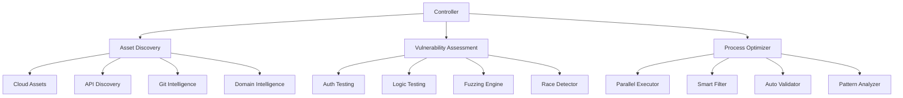

# Enhanced Reconnaissance System for Bug Bounty Hunters

This repository contains a comprehensive framework for maximizing bug bounty effectiveness through enhanced reconnaissance techniques, vulnerability assessment, and process optimization.

## Overview

The Enhanced Reconnaissance System is designed to help bug bounty hunters identify and exploit vulnerabilities more efficiently and effectively. It provides a structured approach to reconnaissance, vulnerability assessment, and reporting, with a focus on high-value targets and vulnerabilities.

## Key Components

### 1. [ENHANCED_RECON_SPEC.md](ENHANCED_RECON_SPEC.md)

This document provides a detailed specification of the enhanced reconnaissance system, including:

- System architecture
- Module descriptions
- Data handling
- Error handling
- Testing plan
- Implementation phases
- Configuration
- API documentation
- Security considerations

### 2. [IMPLEMENTATION_GUIDE.md](IMPLEMENTATION_GUIDE.md)

This guide provides a practical approach to implementing the enhanced reconnaissance system, focusing on high-value components first:

- Core infrastructure setup
- High-value asset discovery implementation
- Vulnerability assessment implementation
- Process optimization implementation
- Usage examples
- Next steps for further enhancement

### 3. [BUG_BOUNTY_STRATEGIES.md](BUG_BOUNTY_STRATEGIES.md)

This document provides key strategies to maximize your bug bounty effectiveness:

- High-value target selection
- Vulnerability prioritization
- Reconnaissance techniques
- Report quality optimization
- Time management strategies
- Program selection
- Continuous improvement

## Getting Started

1. Read the [ENHANCED_RECON_SPEC.md](ENHANCED_RECON_SPEC.md) to understand the overall system design
2. Follow the [IMPLEMENTATION_GUIDE.md](IMPLEMENTATION_GUIDE.md) to set up the system
3. Use the [BUG_BOUNTY_STRATEGIES.md](BUG_BOUNTY_STRATEGIES.md) as a reference for maximizing your bug bounty effectiveness

## System Architecture



## Key Features

- **Modular Architecture**: Easily extend and customize the system
- **Comprehensive Asset Discovery**: Find hidden assets others miss
- **Advanced Vulnerability Assessment**: Detect complex vulnerabilities
- **Process Optimization**: Focus on high-value targets and vulnerabilities
- **Parallel Execution**: Maximize efficiency with concurrent scanning
- **Detailed Reporting**: Generate comprehensive, high-quality reports

## Usage Example

```bash
# Scan a single domain
./enhanced-recon.sh -t example.com

# Scan multiple domains from a file
./enhanced-recon.sh -f domains.txt

# Run a specific module
./enhanced-recon.sh -t example.com -m cloud

# Use a custom output directory
./enhanced-recon.sh -t example.com -o /path/to/output

# Enable debug mode
./enhanced-recon.sh -t example.com -d

# Resume an interrupted scan
./enhanced-recon.sh -t example.com -o /path/to/output -r
```

## Implementation Roadmap

1. **Phase 1: Core Infrastructure** (Week 1)

   - Setup base architecture
   - Implement error handling
   - Setup data storage
   - Implement logging

2. **Phase 2: Asset Discovery** (Week 2)

   - Implement cloud asset discovery
   - Add API endpoint discovery
   - Setup Git intelligence
   - Enhance domain intelligence

3. **Phase 3: Vulnerability Assessment** (Week 3)

   - Add authentication testing
   - Implement business logic testing
   - Setup parameter fuzzing
   - Add race condition detection

4. **Phase 4: Process Optimization** (Week 4)
   - Implement parallel execution
   - Add smart filtering
   - Setup automated validation
   - Implement pattern analysis

## Contributing

Contributions are welcome! Please feel free to submit a Pull Request.

## License

This project is licensed under the MIT License - see the LICENSE file for details.
