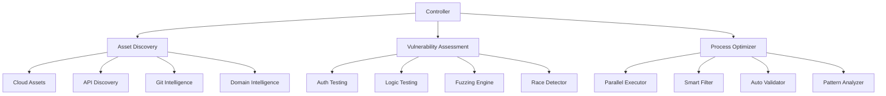

# Enhanced Reconnaissance System Specification

## Overview

This document specifies the enhanced reconnaissance system designed to maximize bug bounty effectiveness through improved asset discovery, vulnerability assessment, and process optimization.

## System Architecture



## 1. Asset Discovery Module

### 1.1 Cloud Asset Discovery

- **Implementation**: New module `src/scanners/cloud/`
- **Components**:
  - S3 Bucket Scanner
  - Azure Blob Scanner
  - GCP Storage Scanner
- **Features**:
  - Permutation-based discovery
  - Access validation
  - Data exposure checking
- **Error Handling**:
  - Rate limiting detection
  - Access denied handling
  - Invalid credential management

### 1.2 API Endpoint Discovery

- **Implementation**: New module `src/scanners/api/`
- **Components**:
  - OpenAPI/Swagger Scanner
  - GraphQL Introspection
  - REST Endpoint Mapper
- **Features**:
  - Authentication detection
  - Parameter mapping
  - Version discovery
- **Error Handling**:
  - Schema validation errors
  - Timeout management
  - Invalid endpoint handling

### 1.3 Git Intelligence

- **Implementation**: New module `src/scanners/git/`
- **Components**:
  - GitHub Dork Engine
  - Commit History Analyzer
  - Secret Scanner
- **Features**:
  - Automated query generation
  - Pattern matching
  - Historical analysis
- **Error Handling**:
  - API rate limiting
  - Authentication failures
  - Invalid repository handling

### 1.4 Enhanced Domain Intelligence

- **Implementation**: Extend existing `src/scanners/passive/`
- **Components**:
  - Advanced Permutation Engine
  - Zone Transfer Checker
  - DNS Pattern Analyzer
- **Features**:
  - Smart wordlist generation
  - Pattern-based discovery
  - Wildcard detection
- **Error Handling**:
  - DNS timeout handling
  - Invalid domain handling
  - Rate limiting management

## 2. Vulnerability Assessment Module

### 2.1 Authentication Testing

- **Implementation**: New module `src/scanners/auth/`
- **Components**:
  - OAuth Flow Tester
  - JWT Analyzer
  - Session Manager
- **Features**:
  - Flow manipulation detection
  - Token analysis
  - Session handling tests
- **Error Handling**:
  - Invalid token handling
  - Timeout management
  - State validation

### 2.2 Business Logic Testing

- **Implementation**: New module `src/scanners/logic/`
- **Components**:
  - Flow Analyzer
  - State Machine Tester
  - Condition Checker
- **Features**:
  - Process flow mapping
  - State transition testing
  - Boundary condition checks
- **Error Handling**:
  - State validation errors
  - Process interruption handling
  - Invalid input management

### 2.3 Parameter Fuzzing

- **Implementation**: New module `src/scanners/fuzzing/`
- **Components**:
  - Smart Fuzzer
  - Pattern Generator
  - Response Analyzer
- **Features**:
  - Adaptive fuzzing
  - Pattern-based generation
  - Response classification
- **Error Handling**:
  - Invalid response handling
  - Timeout management
  - Error state detection

### 2.4 Race Condition Detection

- **Implementation**: New module `src/scanners/race/`
- **Components**:
  - Timing Analyzer
  - Concurrent Request Engine
  - State Validator
- **Features**:
  - Time-based analysis
  - Concurrent testing
  - State verification
- **Error Handling**:
  - Timing validation
  - Concurrency errors
  - State inconsistency

## 3. Process Optimization Module

### 3.1 Parallel Execution Engine

- **Implementation**: New module `src/core/parallel/`
- **Components**:
  - Task Scheduler
  - Resource Manager
  - Result Aggregator
- **Features**:
  - Dynamic scheduling
  - Resource optimization
  - Result correlation
- **Error Handling**:
  - Task failure management
  - Resource exhaustion
  - Result validation

### 3.2 Smart Scope Filter

- **Implementation**: New module `src/core/filter/`
- **Components**:
  - Pattern Matcher
  - Scope Validator
  - Priority Engine
- **Features**:
  - Pattern-based filtering
  - Scope validation
  - Priority assignment
- **Error Handling**:
  - Invalid pattern handling
  - Scope validation errors
  - Priority conflicts

### 3.3 Automated Validator

- **Implementation**: New module `src/core/validator/`
- **Components**:
  - Result Validator
  - False Positive Detector
  - Severity Classifier
- **Features**:
  - Automated validation
  - FP reduction
  - Severity assessment
- **Error Handling**:
  - Validation failures
  - Classification errors
  - Severity conflicts

### 3.4 Pattern Analyzer

- **Implementation**: New module `src/core/patterns/`
- **Components**:
  - Pattern Detector
  - Correlation Engine
  - Priority Assigner
- **Features**:
  - Pattern detection
  - Result correlation
  - Priority management
- **Error Handling**:
  - Pattern matching errors
  - Correlation failures
  - Priority conflicts

## Data Handling

### Storage

- Use SQLite for local storage
- Implement file-based storage for large datasets
- Use Redis for caching (optional)

### Format

- JSON for API responses
- YAML for configurations
- CSV for exported results

### Retention

- Keep raw data for 30 days
- Archive processed results indefinitely
- Implement data cleanup routines

## Error Handling Strategy

### Global Error Handler

```bash
handle_error() {
  local error_type=$1
  local error_message=$2
  local severity=$3

  case $severity in
    "critical")
      log_error "$error_message"
      cleanup
      exit 1
      ;;
    "warning")
      log_warning "$error_message"
      continue
      ;;
    "info")
      log_info "$error_message"
      ;;
  esac
}
```

### Error Types

1. Network Errors
   - Connection timeouts
   - DNS resolution failures
   - Rate limiting
2. Authentication Errors
   - Invalid credentials
   - Token expiration
   - Permission denied
3. Validation Errors
   - Invalid input
   - Schema validation
   - State validation
4. System Errors
   - Resource exhaustion
   - File system errors
   - Database errors

## Testing Plan

### Unit Tests

- Test each module independently
- Mock external dependencies
- Validate error handling

### Integration Tests

- Test module interactions
- Validate data flow
- Check error propagation

### System Tests

- End-to-end testing
- Performance testing
- Load testing

### Test Cases

1. Asset Discovery
   - Valid target discovery
   - Invalid target handling
   - Rate limiting handling
2. Vulnerability Assessment
   - Valid vulnerability detection
   - False positive handling
   - Error state recovery
3. Process Optimization
   - Parallel execution
   - Resource management
   - Result correlation

## Implementation Phases

### Phase 1: Core Infrastructure

1. Setup base architecture
2. Implement error handling
3. Setup data storage
4. Implement logging

### Phase 2: Asset Discovery

1. Implement cloud asset discovery
2. Add API endpoint discovery
3. Setup Git intelligence
4. Enhance domain intelligence

### Phase 3: Vulnerability Assessment

1. Add authentication testing
2. Implement business logic testing
3. Setup parameter fuzzing
4. Add race condition detection

### Phase 4: Process Optimization

1. Implement parallel execution
2. Add smart filtering
3. Setup automated validation
4. Implement pattern analysis

## Configuration

### Example config.yaml

```yaml
asset_discovery:
  cloud:
    enabled: true
    providers:
      - aws
      - azure
      - gcp
    rate_limit: 100
  api:
    enabled: true
    timeout: 30
    max_depth: 5
  git:
    enabled: true
    platforms:
      - github
      - gitlab
    token: ${GIT_TOKEN}

vulnerability_assessment:
  auth:
    enabled: true
    timeout: 60
    max_attempts: 3
  logic:
    enabled: true
    depth: 5
  fuzzing:
    enabled: true
    threads: 10
    patterns:
      - sql
      - xss
      - rce
  race:
    enabled: true
    threads: 5
    timeout: 30

optimization:
  parallel:
    max_threads: 20
    queue_size: 1000
  filter:
    enabled: true
    rules: rules.yaml
  validator:
    enabled: true
    confidence: 0.8
  patterns:
    enabled: true
    learn: true

logging:
  level: info
  file: recon.log
  rotate: true
  max_size: 100M
```

## API Documentation

### REST Endpoints

#### Asset Discovery

```
GET /api/v1/assets/discover
POST /api/v1/assets/validate
GET /api/v1/assets/status/:id
```

#### Vulnerability Assessment

```
POST /api/v1/scan/start
GET /api/v1/scan/status/:id
POST /api/v1/scan/stop/:id
GET /api/v1/scan/results/:id
```

#### Process Optimization

```
GET /api/v1/optimize/status
POST /api/v1/optimize/configure
GET /api/v1/optimize/metrics
```

## Dependencies

### Required

- Python 3.8+
- Go 1.16+
- Node.js 14+
- SQLite 3
- Git 2.0+

### Optional

- Redis 6+
- Docker 20+
- Kubernetes 1.19+

## Security Considerations

1. API Security

   - Rate limiting
   - Authentication
   - Input validation
   - Output encoding

2. Data Security

   - Encryption at rest
   - Secure storage
   - Access control
   - Data minimization

3. Network Security
   - TLS for all connections
   - IP filtering
   - Proxy support
   - VPN compatibility

## Bug Bounty Optimization Strategies

### 1. Target Selection

- Focus on high-value assets
- Prioritize newer acquisitions
- Target less-tested features
- Look for technology transitions

### 2. Vulnerability Prioritization

- Authentication bypasses
- Authorization flaws
- Business logic errors
- Sensitive data exposure
- Server-side request forgery

### 3. Report Quality

- Clear reproduction steps
- Impact assessment
- Mitigation suggestions
- Proof of concept code
- Video demonstrations

### 4. Automation Balance

- Automate reconnaissance
- Manual testing for logic flaws
- Semi-automated fuzzing
- AI-assisted pattern recognition

## Implementation Examples

### Cloud Asset Discovery

```bash
#!/bin/bash
# src/scanners/cloud/s3_scanner.sh

source src/core/utils.sh
source src/core/logging.sh

scan_s3_buckets() {
  local target=$1
  local wordlist=$2
  local output_file=$3

  log_info "Starting S3 bucket scan for $target"

  while read -r word; do
    local bucket_name="${target}-${word}"
    log_debug "Checking bucket: $bucket_name"

    # Check if bucket exists
    if aws s3 ls "s3://$bucket_name" 2>/dev/null; then
      log_success "Found bucket: $bucket_name"
      echo "$bucket_name" >> "$output_file"

      # Check if bucket is public
      if aws s3api get-bucket-acl --bucket "$bucket_name" | grep -q "AllUsers"; then
        log_warning "Bucket is public: $bucket_name"
        echo "$bucket_name,public" >> "$output_file.public"
      fi
    fi
  done < "$wordlist"

  log_info "S3 bucket scan completed for $target"
}

# Main function
main() {
  local target=$1
  local wordlist=${2:-"wordlists/s3-buckets.txt"}
  local output_dir=${3:-"output"}

  # Validate inputs
  validate_input "$target" "Target is required"
  validate_file "$wordlist" "Wordlist file not found"

  # Create output directory
  mkdir -p "$output_dir"
  local output_file="$output_dir/s3_buckets.txt"

  # Run scan
  scan_s3_buckets "$target" "$wordlist" "$output_file"
}

# Execute if run directly
if [[ "${BASH_SOURCE[0]}" == "${0}" ]]; then
  main "$@"
fi
```

### Authentication Testing

```bash
#!/bin/bash
# src/scanners/auth/jwt_analyzer.sh

source src/core/utils.sh
source src/core/logging.sh

analyze_jwt() {
  local token=$1
  local output_file=$2

  log_info "Analyzing JWT token"

  # Decode header
  local header=$(echo "$token" | cut -d. -f1 | base64 -d 2>/dev/null)
  log_debug "Header: $header"

  # Decode payload
  local payload=$(echo "$token" | cut -d. -f2 | base64 -d 2>/dev/null)
  log_debug "Payload: $payload"

  # Check for vulnerabilities

  # 1. Check algorithm
  if echo "$header" | grep -q '"alg":"none"'; then
    log_warning "Vulnerable: Algorithm 'none' detected"
    echo "algorithm_none,high" >> "$output_file"
  fi

  # 2. Check for weak signature
  if echo "$header" | grep -q '"alg":"HS256"'; then
    log_info "HS256 algorithm detected, checking for weak signature"
    # Implement signature strength check
  fi

  # 3. Check expiration
  if ! echo "$payload" | grep -q '"exp":'; then
    log_warning "Vulnerable: No expiration claim"
    echo "missing_expiration,medium" >> "$output_file"
  fi

  log_info "JWT analysis completed"
}

# Main function
main() {
  local token=$1
  local output_dir=${2:-"output"}

  # Validate inputs
  validate_input "$token" "JWT token is required"

  # Create output directory
  mkdir -p "$output_dir"
  local output_file="$output_dir/jwt_vulnerabilities.txt"

  # Run analysis
  analyze_jwt "$token" "$output_file"
}

# Execute if run directly
if [[ "${BASH_SOURCE[0]}" == "${0}" ]]; then
  main "$@"
fi
```

## LLM Integration Points

This specification is designed to be AI/LLM friendly with clear integration points:

1. **Pattern Recognition**

   - LLMs can analyze scan results to identify patterns
   - Correlate findings across different targets
   - Suggest potential vulnerability chains

2. **Report Generation**

   - Generate detailed vulnerability reports
   - Create proof of concept code
   - Suggest mitigation strategies

3. **Workflow Optimization**

   - Analyze scan performance metrics
   - Suggest workflow improvements
   - Optimize resource allocation

4. **Target Prioritization**
   - Analyze historical bug bounty data
   - Identify high-value targets
   - Suggest optimal testing strategies

## Conclusion

This enhanced reconnaissance system specification provides a comprehensive framework for maximizing bug bounty effectiveness. By implementing the modules and strategies outlined in this document, security researchers can significantly improve their asset discovery, vulnerability assessment, and overall process efficiency.

The modular architecture allows for incremental implementation, starting with the highest-value components and gradually expanding capabilities. The emphasis on automation, pattern recognition, and smart filtering will help researchers focus their efforts on the most promising targets and vulnerabilities.
