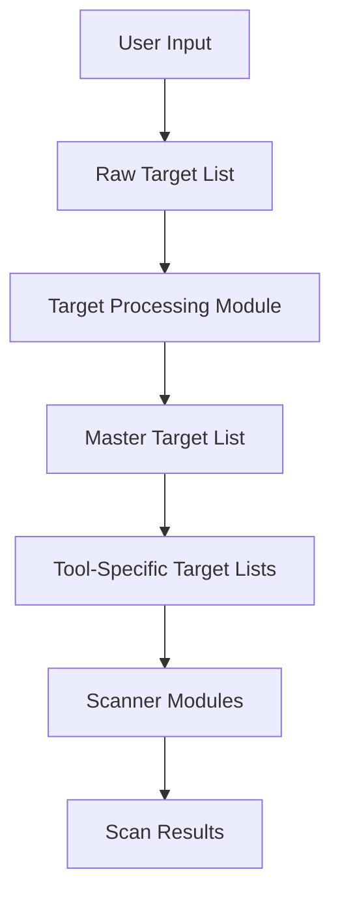

# Target Processing Standardization

This document outlines the standardization of target handling across all tools in the rickjms-recon-scripts framework.

## Problem Statement

Different reconnaissance tools have varying requirements for target formats:

- Some tools require full URLs with protocols (https://example.com)
- Others accept bare domains (example.com)
- Some handle wildcard domains (\*.example.com)
- Some support port specifications (example.com:8080)

This inconsistency leads to:

- Errors when passing incompatible formats to tools
- Duplicate code for target validation and processing
- Difficulty in adding new tools with different requirements

## Solution

A centralized target processing module (`src/core/target_processing.sh`) that:

1. Defines tool-specific requirements in a configuration file
2. Provides functions to process targets according to each tool's needs
3. Validates target formats consistently
4. Creates tool-specific target lists during initialization

## Implementation

### Core Components

1. **Target Processing Module** (`src/core/target_processing.sh`)

   - Core functions for target processing
   - Tool-specific configuration handling
   - Target validation and normalization

2. **Configuration File** (`config/target_processing.conf`)

   - Tool-specific settings
   - Format requirements for each tool
   - Validation rules

3. **Main Script Integration** (`rickjms-recon.sh`)

   - Creates tool-specific target lists
   - Passes appropriate target lists to each scanner

4. **Scanner Module Updates** (e.g., `src/scanners/passive/crtsh.sh`)
   - Use the target processing module
   - Process targets according to tool-specific requirements

### Target Processing Flow



### Configuration Options

Each tool can be configured with the following options:

- `require_protocol`: Whether the tool requires http(s):// prefix
- `handle_wildcards`: Whether to process wildcard domains
- `allow_ports`: Whether to allow port specifications
- `strip_www`: Whether to remove www. prefix
- `validate_dns`: Whether to perform DNS validation
- `max_depth`: Maximum subdomain depth allowed

## Usage Examples

### Processing a Single Target

```bash
# Process a target for a specific tool
processed_target=$(process_target "https://www.example.com:8080" "httpx")
echo "Processed target: $processed_target"  # Output: https://example.com:8080

processed_target=$(process_target "https://www.example.com:8080" "crtsh")
echo "Processed target: $processed_target"  # Output: example.com
```

### Processing a Target List

```bash
# Process a list of targets for a specific tool
process_target_list "input_targets.txt" "httpx_targets.txt" "httpx"
process_target_list "input_targets.txt" "crtsh_targets.txt" "crtsh"
```

## Testing

Two test scripts are provided:

1. **Test Suite** (`tests/target_processing/test_target_processing.sh`)

   - Comprehensive tests for all functions
   - Validates tool-specific processing
   - Verifies error handling

2. **Demo Script** (`tests/target_processing/demo.sh`)
   - Simple demonstration of target processing
   - Shows how different targets are processed for various tools
   - Useful for understanding the module's behavior

## Benefits

- **Consistency**: All tools receive targets in the format they expect
- **Reliability**: Reduces errors from incompatible target formats
- **Maintainability**: Centralizes target handling logic
- **Extensibility**: Makes it easier to add new tools
- **Flexibility**: Configuration-driven approach for tool-specific requirements

## Future Improvements

- Add DNS validation for targets
- Support for IP range processing
- CIDR notation handling
- Custom validation rules per tool
- Target categorization (domain, IP, URL, etc.)
