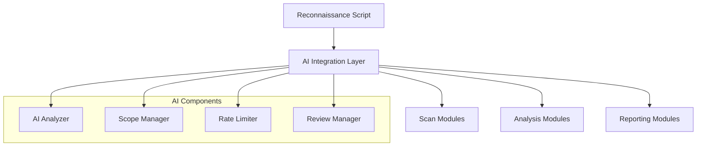

# AI Integration Feature Specification

## 1. Overview

This document outlines the specifications for integrating AI capabilities into the rickjms-recon-scripts reconnaissance framework using the `llm` CLI utility. The integration aims to enhance the tool's capabilities while ensuring ethical usage in bug bounty and security research contexts.

### 1.1 Purpose

To leverage AI capabilities to:

- Enhance analysis of reconnaissance data
- Improve scope management and target validation
- Optimize rate limiting and resource usage
- Provide intelligent reporting and insights
- Ensure ethical usage through human review processes

### 1.2 Requirements

#### Functional Requirements

1. AI-powered analysis of scan results
2. Intelligent scope management and validation
3. Smart rate limiting based on target response patterns
4. Human review workflow for high-risk operations
5. Enhanced reporting with AI-generated insights
6. Pattern detection across different scan types
7. Risk scoring and confidence assessment

#### Non-Functional Requirements

1. Minimal performance overhead
2. Comprehensive audit logging of AI decisions
3. Ethical controls and safeguards
4. Configurable thresholds and parameters
5. Graceful degradation if AI services are unavailable

### 1.3 Dependencies

- `llm` CLI utility (https://github.com/simonw/llm)
- jq (for JSON processing)
- Bash 4.0+ (for associative arrays)
- Python 3.6+ (for llm)

## 2. Architecture Design

### 2.1 High-Level Architecture



### 2.2 Directory Structure

```
src/
├── analysis/
│   ├── ai_analyzer.sh
│   └── correlation_engine.sh
├── scope/
│   └── ai_scope_manager.sh
├── review/
│   └── human_review_manager.sh
├── rate/
│   └── ai_rate_manager.sh
└── reporting/
    └── ai_insights.sh
```

### 2.3 Configuration Structure

New configuration section in `config/settings.sh`:

```bash
# AI Integration Settings
AI_ENABLED=true
LLM_MODEL="gpt-4"  # Default model to use with llm CLI
LLM_TIMEOUT=30     # Timeout in seconds for LLM requests

# Analysis settings
ANALYSIS_CONFIDENCE_THRESHOLD=0.7
CORRELATION_DEPTH=2

# Scope management settings
RISK_THRESHOLD=7                  # Maximum acceptable risk score (1-10)
MAX_PATTERN_DEPTH=3               # Maximum depth for pattern analysis
SCOPE_CONFIDENCE_THRESHOLD=0.8    # Minimum confidence for scope decisions
REQUIRE_HUMAN_REVIEW=true         # Require human review for high-risk targets

# Review trigger settings
declare -A REVIEW_TRIGGERS=(
    ["risk_score"]=7
    ["sensitive_patterns"]="admin|security|auth|payment"
    ["unusual_behavior"]="true"
)

# Rate limiting settings
AI_RATE_LIMITING=true
ADAPTIVE_RATE_LIMITING=true
RATE_LEARNING_FACTOR=0.8
```

## 3. Component Specifications

### 3.1 AI Analyzer Module

#### 3.1.1 Purpose

Analyze scan results using AI to identify patterns, potential vulnerabilities, and security insights.

#### 3.1.2 Implementation

File: `src/analysis/ai_analyzer.sh`

```bash
#!/bin/bash

# Import required modules
source "$(dirname "${BASH_SOURCE[0]}")/../../core/logging.sh"
source "$(dirname "${BASH_SOURCE[0]}")/../../core/utils.sh"

# AI Analysis of HTTP responses
analyze_http_responses() {
    local responses_file="$1"
    local output_file="$2"

    debug "Analyzing HTTP responses with AI"

    # Create output directory if it doesn't exist
    mkdir -p "$(dirname "$output_file")"

    # Use llm to analyze response patterns
    if ! llm "Analyze these HTTP responses for security implications: $(cat $responses_file)" \
        --system "You are a security expert analyzing HTTP responses. Focus on: 1) Security headers 2) Unusual patterns 3) Potential vulnerabilities 4) Misconfigurations. Format your response as markdown with clear sections." \
        --model "$LLM_MODEL" \
        --timeout "$LLM_TIMEOUT" \
        > "$output_file" 2>/dev/null; then

        warn "AI analysis of HTTP responses failed"
        echo "# AI Analysis Failed" > "$output_file"
        echo "The AI analysis of HTTP responses failed. Please review the data manually." >> "$output_file"
        return 1
    fi

    info "AI analysis of HTTP responses completed"
    return 0
}

# AI Analysis of discovered endpoints
analyze_endpoints() {
    local endpoints_file="$1"
    local output_file="$2"

    debug "Analyzing endpoints with AI"

    # Create output directory if it doesn't exist
    mkdir -p "$(dirname "$output_file")"

    # Use llm to identify high-risk endpoints
    if ! llm "Review these endpoints for security risks: $(cat $endpoints_file)" \
        --system "You are a security expert analyzing web endpoints. Identify: 1) Admin interfaces 2) API endpoints 3) Development artifacts 4) Authentication endpoints 5) File upload/download endpoints. Format your response as markdown with clear sections and risk ratings (Low/Medium/High/Critical) for each finding." \
        --model "$LLM_MODEL" \
        --timeout "$LLM_TIMEOUT" \
        > "$output_file" 2>/dev/null; then

        warn "AI analysis of endpoints failed"
        echo "# AI Analysis Failed" > "$output_file"
        echo "The AI analysis of endpoints failed. Please review the data manually." >> "$output_file"
        return 1
    fi

    info "AI analysis of endpoints completed"
    return 0
}

# AI Analysis of JavaScript files
analyze_javascript() {
    local js_file="$1"
    local output_file="$2"

    debug "Analyzing JavaScript with AI"

    # Create output directory if it doesn't exist
    mkdir -p "$(dirname "$output_file")"

    # Use llm to analyze JavaScript for sensitive information
    if ! llm "Analyze this JavaScript code for security issues: $(cat $js_file)" \
        --system "You are a security expert analyzing JavaScript. Look for: 1) API keys 2) Hardcoded credentials 3) Sensitive endpoints 4) Insecure configurations 5) Vulnerable dependencies. Format your response as markdown with clear sections and risk ratings (Low/Medium/High/Critical) for each finding." \
        --model "$LLM_MODEL" \
        --timeout "$LLM_TIMEOUT" \
        > "$output_file" 2>/dev/null; then

        warn "AI analysis of JavaScript failed"
        echo "# AI Analysis Failed" > "$output_file"
        echo "The AI analysis of JavaScript failed. Please review the code manually." >> "$output_file"
        return 1
    fi

    info "AI analysis of JavaScript completed"
    return 0
}

# Score confidence of findings
score_confidence() {
    local finding="$1"
    local output_file="$2"

    debug "Scoring confidence of findings with AI"

    # Create output directory if it doesn't exist
    mkdir -p "$(dirname "$output_file")"

    # Use llm to score confidence of findings
    if ! llm "Score the confidence of this security finding: $finding" \
        --system "You are a security expert scoring findings. Consider: 1) Evidence quality 2) False positive likelihood 3) Impact severity. Provide a confidence score from 0.0 to 1.0, with 1.0 being absolute certainty. Format your response as a JSON object with 'score' and 'reasoning' fields." \
        --model "$LLM_MODEL" \
        --timeout "$LLM_TIMEOUT" \
        > "$output_file" 2>/dev/null; then

        warn "AI confidence scoring failed"
        echo '{"score": 0.5, "reasoning": "Confidence scoring failed, using default medium confidence"}' > "$output_file"
        return 1
    fi

    info "AI confidence scoring completed"
    return 0
}
```

#### 3.1.3 Integration Points

- HTTP Probe Enhancement (`src/scanners/active/http_probe.sh`)
- JavaScript Analysis Enhancement (`src/scanners/active/crawler.sh`)
- Vulnerability Scanning Enhancement (`src/scanners/active/vuln_scan.sh`)

### 3.2 Correlation Engine

#### 3.2.1 Purpose

Identify patterns and correlations across different scan types and results.

#### 3.2.2 Implementation

File: `src/analysis/correlation_engine.sh`

```bash
#!/bin/bash

# Import required modules
source "$(dirname "${BASH_SOURCE[0]}")/../../core/logging.sh"
source "$(dirname "${BASH_SOURCE[0]}")/../../core/utils.sh"

# Analyze patterns across different scan results
analyze_patterns() {
    local all_findings="$1"
    local output_file="$2"

    debug "Analyzing patterns with AI"

    # Create output directory if it doesn't exist
    mkdir -p "$(dirname "$output_file")"

    # Use llm to identify patterns across different scan types
    if ! llm "Analyze these findings for correlation patterns: $(cat $all_findings)" \
        --system "You are a security expert looking for patterns across: 1) Endpoint structures 2) Response behaviors 3) Technology stacks 4) Common vulnerabilities. Format your response as markdown with clear sections for each pattern type discovered. For each pattern, provide examples and potential security implications." \
        --model "$LLM_MODEL" \
        --timeout "$LLM_TIMEOUT" \
        > "$output_file" 2>/dev/null; then

        warn "AI pattern analysis failed"
        echo "# AI Pattern Analysis Failed" > "$output_file"
        echo "The AI pattern analysis failed. Please review the data manually." >> "$output_file"
        return 1
    fi

    info "AI pattern analysis completed"
    return 0
}

# Generate correlation map
generate_correlation_map() {
    local scan_data_dir="$1"
    local output_file="$2"

    debug "Generating correlation map with AI"

    # Create temporary file with aggregated data
    local temp_data=$(mktemp)

    # Aggregate relevant data
    echo "# Aggregated Scan Data" > "$temp_data"

    # Add HTTP probe data
    if [[ -f "$ALIVE/httpx_analysis.txt" ]]; then
        echo "## HTTP Probe Data" >> "$temp_data"
        cat "$ALIVE/httpx_analysis.txt" >> "$temp_data"
        echo "" >> "$temp_data"
    fi

    # Add crawler data
    if [[ -f "$CRAWLING/hakrawler_analysis.txt" ]]; then
        echo "## Crawler Data" >> "$temp_data"
        cat "$CRAWLING/hakrawler_analysis.txt" >> "$temp_data"
        echo "" >> "$temp_data"
    fi

    # Add JavaScript analysis
    if [[ -d "$JS_SCANNING" ]]; then
        echo "## JavaScript Analysis" >> "$temp_data"
        cat "$JS_SCANNING"/*_analysis.txt 2>/dev/null >> "$temp_data"
        echo "" >> "$temp_data"
    fi

    # Add vulnerability scan data
    if [[ -d "$POST_SCAN_ENUM/vuln_scan" ]]; then
        echo "## Vulnerability Data" >> "$temp_data"
        cat "$POST_SCAN_ENUM/vuln_scan"/*_analysis.txt 2>/dev/null >> "$temp_data"
        echo "" >> "$temp_data"
    fi

    # Create output directory if it doesn't exist
    mkdir -p "$(dirname "$output_file")"

    # Use llm to generate correlation map
    if ! llm "Generate a correlation map of security findings from this data: $(cat $temp_data)" \
        --system "You are a security expert creating a correlation map. Identify relationships between: 1) Technologies and vulnerabilities 2) Endpoints and security issues 3) Response patterns and potential weaknesses. Format your response as a markdown document with sections for each correlation type. Include a mermaid graph diagram showing the key relationships." \
        --model "$LLM_MODEL" \
        --timeout "$LLM_TIMEOUT" \
        > "$output_file" 2>/dev/null; then

        warn "AI correlation map generation failed"
        echo "# AI Correlation Map Failed" > "$output_file"
        echo "The AI correlation map generation failed. Please review the data manually." >> "$output_file"
        rm -f "$temp_data"
        return 1
    fi

    # Clean up
    rm -f "$temp_data"

    info "AI correlation map generated"
    return 0
}
```

### 3.3 AI Scope Manager

#### 3.3.1 Purpose

Intelligently manage target scope to ensure ethical reconnaissance.

#### 3.3.2 Implementation

File: `src/scope/ai_scope_manager.sh`

```bash
#!/bin/bash

# Import required modules
source "$(dirname "${BASH_SOURCE[0]}")/../../core/logging.sh"
source "$(dirname "${BASH_SOURCE[0]}")/../../core/utils.sh"

# AI-powered scope validation
validate_scope() {
    local domain="$1"
    local scope_file="$2"
    local output_file="$3"

    debug "Validating scope with AI for domain: $domain"

    # Create output directory if it doesn't exist
    mkdir -p "$(dirname "$output_file")"

    # Use llm to analyze domain against scope patterns
    if ! llm "Analyze if this domain ($domain) matches scope patterns: $(cat $scope_file)" \
        --system "You are a security expert determining if domains are in scope. Consider: 1) Domain patterns 2) Wildcards 3) Explicit exclusions. Format your response as a JSON object with 'in_scope' (boolean), 'confidence' (0.0-1.0), 'reasoning' (string), and 'decision' (string, either 'IN_SCOPE' or 'OUT_OF_SCOPE')." \
        --model "$LLM_MODEL" \
        --timeout "$LLM_TIMEOUT" \
        > "$output_file" 2>/dev/null; then

        warn "AI scope validation failed for domain: $domain"
        echo '{"in_scope": false, "confidence": 0.0, "reasoning": "AI scope validation failed", "decision": "OUT_OF_SCOPE"}' > "$output_file"
        return 1
    fi

    # Validate JSON output
    if ! jq empty "$output_file" 2>/dev/null; then
        warn "AI returned invalid JSON for scope validation of domain: $domain"
        echo '{"in_scope": false, "confidence": 0.0, "reasoning": "AI returned invalid JSON", "decision": "OUT_OF_SCOPE"}' > "$output_file"
        return 1
    fi

    # Log decision
    local decision=$(jq -r '.decision // "OUT_OF_SCOPE"' "$output_file")
    local confidence=$(jq -r '.confidence // 0.0' "$output_file")
    local reasoning=$(jq -r '.reasoning // "No reasoning provided"' "$output_file")

    info "AI scope validation for $domain: $decision (confidence: $confidence)"
    debug "Reasoning: $reasoning"

    # Return success/failure based on decision
    if [[ "$decision" == "IN_SCOPE" ]]; then
        return 0
    else
        return 1
    fi
}

# Pattern detection for related domains
analyze_domain_patterns() {
    local discovered_domains="$1"
    local scope_file="$2"
    local output_file="$3"

    debug "Analyzing domain patterns with AI"

    # Create output directory if it doesn't exist
    mkdir -p "$(dirname "$output_file")"

    # Use llm to identify domain patterns and relationships
    if ! llm "Analyze these domains for patterns and relationships: $(cat $discovered_domains)" \
        --system "You are a security expert analyzing domain relationships. Identify: 1) Naming patterns 2) Subdomain structures 3) Development patterns. Format your response as markdown with clear sections for each pattern type. Include a 'PATTERNS' section with a JSON array of regex patterns that could be used to match similar domains." \
        --model "$LLM_MODEL" \
        --timeout "$LLM_TIMEOUT" \
        > "$output_file" 2>/dev/null; then

        warn "AI domain pattern analysis failed"
        echo "# AI Domain Pattern Analysis Failed" > "$output_file"
        echo "The AI domain pattern analysis failed. Please review the domains manually." >> "$output_file"
        return 1
    fi

    info "AI domain pattern analysis completed"
    return 0
}

# Risk scoring for discovered domains
score_domain_risk() {
    local domain="$1"
    local context="$2"
    local output_file="$3"

    debug "Scoring domain risk with AI for domain: $domain"

    # Create output directory if it doesn't exist
    mkdir -p "$(dirname "$output_file")"

    # Use llm to assess domain risk
    if ! llm "Score the risk level for scanning this domain ($domain) with context: $context" \
        --system "You are a security expert assessing domain scan risks. Consider: 1) Production vs Non-prod 2) Sensitive services 3) Potential impact. Provide a risk score from 1 (lowest risk) to 10 (highest risk). Format your response as a JSON object with 'score' (integer 1-10), 'reasoning' (string), and 'risk_factors' (array of strings)." \
        --model "$LLM_MODEL" \
        --timeout "$LLM_TIMEOUT" \
        > "$output_file" 2>/dev/null; then

        warn "AI risk scoring failed for domain: $domain"
        echo '{"score": 5, "reasoning": "AI risk scoring failed, using default medium risk", "risk_factors": ["Unknown"]}' > "$output_file"
        return 1
    fi

    # Validate JSON output
    if ! jq empty "$output_file" 2>/dev/null; then
        warn "AI returned invalid JSON for risk scoring of domain: $domain"
        echo '{"score": 5, "reasoning": "AI returned invalid JSON", "risk_factors": ["Unknown"]}' > "$output_file"
        return 1
    fi

    # Log risk score
    local score=$(jq -r '.score // 5' "$output_file")
    local reasoning=$(jq -r '.reasoning // "No reasoning provided"' "$output_file")

    info "AI risk score for $domain: $score/10"
    debug "Reasoning: $reasoning"

    return 0
}
```

### 3.4 Human Review Manager

#### 3.4.1 Purpose

Manage the human review process for high-risk operations.

#### 3.4.2 Implementation

File: `src/review/human_review_manager.sh`

```bash
#!/bin/bash

# Import required modules
source "$(dirname "${BASH_SOURCE[0]}")/../../core/logging.sh"
source "$(dirname "${BASH_SOURCE[0]}")/../../core/utils.sh"

# Human review interface
create_review_request() {
    local domain="$1"
    local risk_data="$2"
    local output_dir="$3"
    local review_id=$(uuidgen | cut -d'-' -f1)
    local review_file="$output_dir/reviews/${review_id}.md"

    debug "Creating review request for domain: $domain (ID: $review_id)"

    # Create output directory if it doesn't exist
    mkdir -p "$output_dir/reviews"

    # Generate detailed review document
    {
        echo "# Security Review Request ($review_id)"
        echo "## Target Information"
        echo "Domain: $domain"
        echo "Timestamp: $(date '+%Y-%m-%d %H:%M:%S')"
        echo
        echo "## Risk Assessment"
        cat "$risk_data"
        echo
        echo "## AI Analysis"
    } > "$review_file"

    # Generate AI analysis
    if ! llm "Provide a detailed security analysis for domain ($domain) with context: $(cat $risk_data)" \
        --system "You are a security expert providing risk analysis. Include: 1) Key risks 2) Potential impacts 3) Recommended precautions. Format your response as markdown with clear sections for each aspect of the analysis." \
        --model "$LLM_MODEL" \
        --timeout "$LLM_TIMEOUT" \
        >> "$review_file" 2>/dev/null; then

        warn "AI analysis for review request failed"
        echo "AI analysis failed. Please review the risk data manually." >> "$review_file"
    fi

    # Complete the review document
    {
        echo
        echo "## Decision Required"
        echo "- [ ] Approve for scanning"
        echo "- [ ] Exclude from scope"
        echo "- [ ] Request additional information"
        echo
        echo "## Justification"
        echo "_Please provide reasoning for decision:_"
        echo
        echo "## Additional Controls"
        echo "_Specify any required scanning restrictions:_"
    } >> "$review_file"

    info "Created review request: $review_id for domain: $domain"
    echo "$review_id"
}

# Process review decision
process_review_decision() {
    local review_id="$1"
    local decision="$2"
    local justification="$3"
    local reviewer="$4"
    local output_dir="$5"
    local review_file="$output_dir/reviews/${review_id}.md"

    debug "Processing review decision for review ID: $review_id"

    # Validate review file exists
    if [[ ! -f "$review_file" ]]; then
        error "Review file not found: $review_file"
        return 1
    fi

    # Log decision
    {
        echo
        echo "## Review Decision"
        echo "Decision: $decision"
        echo "Reviewer: $reviewer"
        echo "Timestamp: $(date '+%Y-%m-%d %H:%M:%S')"
        echo
        echo "### Justification"
        echo "$justification"
    } >> "$review_file"

    # Update audit trail
    log_review_decision "$review_id" "$decision" "$justification" "$reviewer" "$output_dir"

    info "Processed review decision for review ID: $review_id - Decision: $decision"
    return 0
}

# Check if review is needed
needs_review() {
    local domain="$1"
    local risk_data="$2"

    debug "Checking if review is needed for domain: $domain"

    # Check if REQUIRE_HUMAN_REVIEW is enabled
    if [[ "$REQUIRE_HUMAN_REVIEW" != "true" ]]; then
        debug "Human review not required (disabled in settings)"
        return 1
    fi

    # Check risk score
    local risk_score=$(jq -r '.score // 0' "$risk_data")
    if [[ -z "$risk_score" || "$risk_score" -lt "${REVIEW_TRIGGERS[risk_score]:-7}" ]]; then
        debug "Risk score ($risk_score) below threshold (${REVIEW_TRIGGERS[risk_score]:-7})"
        return 1
    fi

    # Check sensitive patterns
    local sensitive_patterns="${REVIEW_TRIGGERS[sensitive_patterns]}"
    if [[ -n "$sensitive_patterns" ]] && grep -q -E "$sensitive_patterns" "$risk_data"; then
        debug "Sensitive patterns detected in domain: $domain"
        return 0
    fi

    # Check unusual behavior flag
    if [[ "${REVIEW_TRIGGERS[unusual_behavior]}" == "true" ]] && grep -q -i "unusual|anomaly|suspicious" "$risk_data"; then
        debug "Unusual behavior detected for domain: $domain"
        return 0
    fi

    # If risk score is high enough, review is needed
    if [[ "$risk_score" -ge "${REVIEW_TRIGGERS[risk_score]:-7}" ]]; then
        debug "Risk score ($risk_score) requires review"
        return 0
    fi

    debug "No review triggers matched for domain: $domain"
    return 1
}

# Wait for review completion
wait_for_review() {
    local review_id="$1"
    local output_dir="$2"
    local review_file="$output_dir/reviews/${review_id}.md"
    local timeout="${REVIEW_TIMEOUT:-3600}"  # Default 1 hour
    local start_time=$(date +%s)
    local reminder_interval="${REVIEW_REMINDER_INTERVAL:-300}"  # Default 5 minutes
    local last_reminder=$start_time

    debug "Waiting for review completion: $review_id"

    while true; do
        # Check if review file exists
        if [[ ! -f "$review_file" ]]; then
            error "Review file not found: $review_file"
            return 1
        fi

        # Check if review is completed
        if grep -q "^## Review Decision" "$review_file"; then
            info "Review completed for review ID: $review_id"
            return 0
        fi

        # Check timeout
        local current_time=$(date +%s)
        local elapsed=$((current_time - start_time))

        if [[ $elapsed -ge $timeout ]]; then
            warn "Review timeout for review ID: $review_id"
            return 1
        fi

        # Send reminder if needed
        if [[ $((current_time - last_reminder)) -ge $reminder_interval ]]; then
            warn "Waiting for review completion: $review_id (elapsed: ${elapsed}s)"
            last_reminder=$current_time
        fi

        # Sleep for a bit
        sleep 30
    done
}

# Check review approval
check_review_approval() {
    local review_id="$1"
    local output_dir="$2"
    local review_file="$output_dir/reviews/${review_id}.md"

    debug "Checking review approval for review ID: $review_id"

    # Validate review file exists
    if [[ ! -f "$review_file" ]]; then
        error "Review file not found: $review_file"
        return 1
    fi

    # Check decision
    if grep -q "Decision: Approve" "$review_file"; then
        info "Review approved for review ID: $review_id"
        return 0
    else
        info "Review not approved for review ID: $review_id"
        return 1
    fi
}
```

### 3.5 AI Rate Manager

#### 3.5.1 Purpose

Optimize rate limiting based on target response patterns.

#### 3.5.2 Implementation

File: `src/rate/ai_rate_manager.sh`

```bash
#!/bin/bash

# Import required modules
source "$(dirname "${BASH_SOURCE[0]}")/../../core/logging.sh"
source "$(dirname "${BASH_SOURCE[0]}")/../../core/utils.sh"
source "$(dirname "${BASH_SOURCE[0]}")/../api/rate_limiting.sh"

# Analyze target response patterns
analyze_response_patterns() {
    local target="$1"
    local response_data="$2"
    local output_file="$3"

    debug "Analyzing response patterns with AI for target: $target"

    # Create output directory if it doesn't exist
    mkdir -p "$(dirname "$output_file")"

    # Use llm to analyze response patterns
    if ! llm "Analyze these HTTP responses for rate limiting patterns: $(cat $response_data)" \
        --system "You are a security expert analyzing HTTP responses for rate limiting. Identify: 1) WAF presence 2) Rate limiting headers 3) Blocking patterns 4) Response time patterns. Format your response as a JSON object with 'waf_detected' (boolean), 'rate_limiting_detected' (boolean), 'recommended_delay' (integer in seconds), 'recommended_max_rate' (integer requests per minute), and 'reasoning' (string)." \
        --model "$LLM_MODEL" \
        --timeout "$LLM_TIMEOUT" \
        > "$output_file" 2>/dev/null; then

        warn "AI response pattern analysis failed for target: $target"
        echo '{"waf_detected": false, "rate_limiting_detected": false, "recommended_delay": 5, "recommended_max_rate": 30, "reasoning": "AI analysis failed, using default values"}' > "$output_file"
        return 1
    fi

    # Validate JSON output
    if ! jq empty "$output_file" 2>/dev/null; then
        warn "AI returned invalid JSON for response pattern analysis of target: $target"
        echo '{"waf_detected": false, "rate_limiting_detected": false, "recommended_delay": 5, "recommended_max_rate": 30, "reasoning": "AI returned invalid JSON"}' > "$output_file"
        return 1
    fi

    # Log recommendations
    local waf_detected=$(jq -r '.waf_detected // false' "$output_file")
    local rate_limiting_detected=$(jq -r '.rate_limiting_detected // false' "$output_file")
    local recommended_delay=$(jq -r '.recommended_delay // 5' "$output_file")
    local recommended_max_rate=$(jq -r '.recommended_max_rate // 30' "$output_file")

    info "AI rate limiting analysis for $target: WAF: $waf_detected, Rate limiting: $rate_limiting_detected"
    info "Recommended delay: ${recommended_delay}s, Max rate: $recommended_max_rate/min"

    return 0
}

# Optimize rate limits based on target response
optimize_rate_limits() {
    local target="$1"
    local analysis_file="$2"

    debug "Optimizing rate limits for target: $target"

    # Validate analysis file exists
    if [[ ! -f "$analysis_file" ]]; then
        warn "Analysis file not found: $analysis_file"
        return 1
    fi

    # Extract recommendations
    local waf_detected=$(jq -r '.waf_detected // false' "$analysis_file")
    local rate_limiting_detected=$(jq -r '.rate_limiting_detected // false' "$analysis_file")
    local recommended_delay=$(jq -r '.recommended_delay // 5' "$analysis_file")
    local recommended_max_rate=$(jq -r '.recommended_max_rate // 30' "$analysis_file")

    # Apply recommendations
    if [[ "$waf_detected" == "true" || "$rate_limiting_detected" == "true" ]]; then
        # Get API name from target domain
        local api_name=$(echo "$target" | cut -d'.' -f2-)

        # Update rate limit
        add_api_rate_limit "$api_name" "$recommended_max_rate"

        info "Updated rate limit for $api_name to $recommended_max_rate requests/minute"

        # Apply delay if needed
        if [[ $recommended_delay -gt 1 ]]; then
            info "Setting delay between requests to ${recommended_delay}s for $api_name"
            # Store delay in a global variable or config file
            echo "$api_name:$recommended_delay" >> "$POST_SCAN_ENUM/rate_limits.conf"
        fi
    fi

    return 0
}

# Apply adaptive rate limiting
apply_adaptive_rate_limiting() {
    local target="$1"
    local response_code="$2"
    local response_time="$3"

    debug "Applying adaptive rate limiting for target: $target"

    # Skip if adaptive rate limiting is disabled
    if [[ "$ADAPTIVE_RATE_LIMITING" != "true" ]]; then
        return 0
    fi

    # Get current rate limit
    local api_name=$(echo "$target" | cut -d'.' -f2-)
    local current_limit=$(get_api_rate_limit "$api_name")

    # Default to a reasonable value if not set
    if [[ -z "$current_limit" || "$current_limit" -eq 0 ]]; then
        current_limit=30
    fi

    # Adjust based on response code
    local new_limit=$current_limit

    if [[ "$response_code" == "429" || "$response_code" == "503" ]]; then
        # Too many requests or service unavailable - reduce rate
        new_limit=$(( current_limit / 2 ))
        info "Rate limiting detected (HTTP $response_code) - reducing rate for $api_name"
    elif [[ "$response_code" == "403" || "$response_code" == "401" ]]; then
        # Forbidden or unauthorized - potential WAF block
        new_limit=$(( current_limit / 3 ))
        warn "Potential WAF block detected (HTTP $response_code) - significantly reducing rate for $api_name"
    elif [[ "$response_time" -gt 2000 ]]; then
        # Slow response - reduce rate slightly
        new_limit=$(( current_limit * 8 / 10 ))
        info "Slow response time (${response_time}ms) - slightly reducing rate for $api_name"
    elif [[ "$response_code" -ge 200 && "$response_code" -lt 300 && "$response_time" -lt 500 ]]; then
        # Good response - can potentially increase rate
        new_limit=$(( current_limit * 11 / 10 ))
        debug "Good response - slightly increasing rate for $api_name"
    fi

    # Ensure reasonable limits
    if [[ $new_limit -lt 5 ]]; then
        new_limit=5
    elif [[ $new_limit -gt 100 ]]; then
        new_limit=100
    fi

    # Only update if changed
    if [[ $new_limit -ne $current_limit ]]; then
        add_api_rate_limit "$api_name" "$new_limit"
        info "Adaptively adjusted rate limit for $api_name: $current_limit -> $new_limit requests/minute"
    fi

    return 0
}
```

### 3.6 AI Insights Module

#### 3.6.1 Purpose

Generate enhanced reports with AI-powered insights and recommendations.

#### 3.6.2 Implementation

File: `src/reporting/ai_insights.sh`

```bash
#!/bin/bash

# Import required modules
source "$(dirname "${BASH_SOURCE[0]}")/../../core/logging.sh"
source "$(dirname "${BASH_SOURCE[0]}")/../../core/utils.sh"

# Generate AI insights from scan results
generate_ai_insights() {
    local scan_data_dir="$1"
    local output_file="$2"

    debug "Generating AI insights from scan results"

    # Create temporary file for aggregated data
    local temp_data=$(mktemp)

    # Aggregate relevant data
    {
        echo "# Scan Results Summary"
        echo "Generated: $(date '+%Y-%m-%d %H:%M:%S')"
        echo

        # Add subdomain information
        if [[ -f "$SCAN_FOLDER/crtsh.host.out" ]]; then
            echo "## Subdomains"
            echo "Total discovered: $(wc -l < "$SCAN_FOLDER/crtsh.host.out")"
            echo "Sample:"
            head -n 10 "$SCAN_FOLDER/crtsh.host.out"
            echo
        fi

        # Add HTTP probe information
        if [[ -f "$ALIVE/httpx_analysis.txt" ]]; then
            echo "## HTTP Services"
            cat "$ALIVE/httpx_analysis.txt"
            echo
        fi

        # Add crawler information
        if [[ -f "$CRAWLING/hakrawler_analysis.txt" ]]; then
            echo "## Web Crawling"
            cat "$CRAWLING/hakrawler_analysis.txt"
            echo
        fi

        # Add vulnerability information
        if [[ -d "$POST_SCAN_ENUM/vuln_scan" ]]; then
            echo "## Vulnerabilities"
            find "$POST_SCAN_ENUM/vuln_scan" -name "*_analysis.txt" -exec cat {} \; 2>/dev/null
            echo
        fi

        # Add AI analysis information
        if [[ -d "$POST_SCAN_ENUM/ai_analysis" ]]; then
            echo "## Previous AI Analysis"
            find "$POST_SCAN_ENUM/ai_analysis" -name "*.md" -exec cat {} \; 2>/dev/null
            echo
        fi
    } > "$temp_data"

    # Create output directory if it doesn't exist
    mkdir -p "$(dirname "$output_file")"

    # Use llm to generate insights
    if ! llm "Generate comprehensive security insights from these reconnaissance results: $(cat $temp_data)" \
        --system "You are a security expert analyzing reconnaissance results. Provide: 1) Executive summary 2) Key findings 3) Risk assessment 4) Recommended actions 5) Potential vulnerabilities. Format your response as a markdown document with clear sections. Include a severity rating for each finding (Low/Medium/High/Critical)." \
        --model "$LLM_MODEL" \
        --timeout "$LLM_TIMEOUT" \
        > "$output_file" 2>/dev/null; then

        warn "AI insights generation failed"
        echo "# AI Insights Generation Failed" > "$output_file"
        echo "The AI insights generation failed. Please review the scan results manually." >> "$output_file"
        rm -f "$temp_data"
        return 1
    fi

    # Clean up
    rm -f "$temp_data"

    info "AI insights generated successfully"
    return 0
}

# Generate remediation recommendations
generate_remediation_recommendations() {
    local findings_file="$1"
    local output_file="$2"

    debug "Generating remediation recommendations"

    # Create output directory if it doesn't exist
    mkdir -p "$(dirname "$output_file")"

    # Use llm to generate remediation recommendations
    if ! llm "Generate detailed remediation recommendations for these security findings: $(cat $findings_file)" \
        --system "You are a security expert providing remediation advice. For each finding, provide: 1) Detailed explanation 2) Step-by-step remediation instructions 3) References to security best practices or standards 4) Verification steps. Format your response as a markdown document with clear sections for each finding." \
        --model "$LLM_MODEL" \
        --timeout "$LLM_TIMEOUT" \
        > "$output_file" 2>/dev/null; then

        warn "AI remediation recommendations generation failed"
        echo "# AI Remediation Recommendations Failed" > "$output_file"
        echo "The AI remediation recommendations generation failed. Please review the findings manually." >> "$output_file"
        return 1
    fi

    info "AI remediation recommendations generated successfully"
    return 0
}

# Generate executive summary
generate_executive_summary() {
    local insights_file="$1"
    local output_file="$2"

    debug "Generating executive summary"

    # Create output directory if it doesn't exist
    mkdir -p "$(dirname "$output_file")"

    # Use llm to generate executive summary
    if ! llm "Generate a concise executive summary of these security insights: $(cat $insights_file)" \
        --system "You are a security expert creating an executive summary. Include: 1) Overall risk assessment 2) Key findings summary 3) Critical recommendations 4) Next steps. Keep it concise (max 500 words) and non-technical, suitable for management. Format your response as a markdown document." \
        --model "$LLM_MODEL" \
        --timeout "$LLM_TIMEOUT" \
        > "$output_file" 2>/dev/null; then

        warn "AI executive summary generation failed"
        echo "# AI Executive Summary Failed" > "$output_file"
        echo "The AI executive summary generation failed. Please review the insights manually." >> "$output_file"
        return 1
    fi

    info "AI executive summary generated successfully"
    return 0
}
```

## 4. Integration with Main Script

### 4.1 Main Script Modifications

File: `rickjms-recon.sh`

```bash
# Add AI integration imports
source "$SCRIPT_DIR/src/analysis/ai_analyzer.sh"
source "$SCRIPT_DIR/src/analysis/correlation_engine.sh"
source "$SCRIPT_DIR/src/scope/ai_scope_manager.sh"
source "$SCRIPT_DIR/src/review/human_review_manager.sh"
source "$SCRIPT_DIR/src/rate/ai_rate_manager.sh"
source "$SCRIPT_DIR/src/reporting/ai_insights.sh"

# Modify consolidateTargets() function to use AI scope validation
consolidateTargets() {
    debug "consolidateTargets()"

    # Create temporary files
    TARGET_LIST=$(mktemp)
    SCOPE_ANALYSIS=$(mktemp)

    # Create AI analysis directory
    mkdir -p "$POST_SCAN_ENUM/ai_analysis"
    mkdir -p "$POST_SCAN_ENUM/scope_analysis"

    if filePassed; then
        debug "File passed, processing with AI scope validation"

        # Process each line in the input file
        while IFS= read -r line || [[ -n "$line" ]]; do
            # Skip empty lines
            [[ -z "$line" ]] && continue

            # Check if line is a wildcard pattern
            if [[ "$line" == *"*."* ]]; then
                debug "Wildcard pattern detected: $line"
                # Extract the base domain from wildcard pattern
                base_domain=$(echo "$line" | sed 's/^\*\.//')

                # Validate scope with AI
                if [[ "$AI_ENABLED" == "true" ]]; then
                    local scope_file="$POST_SCAN_ENUM/scope_analysis/${base_domain}_scope.json"
                    if validate_scope "$base_domain" "$USER_FILE" "$scope_file"; then
                        echo "$base_domain" >> "$TARGET_LIST"
                        info "AI validated domain in scope: $base_domain"
                    else
                        warn "AI determined domain out of scope: $base_domain"
                        echo "$base_domain" >> "$POSSIBLE_OOS_TARGETS/excluded_by_ai.txt"
                    fi
                else
                    echo "$base_domain" >> "$TARGET_LIST"
                    info "Converted wildcard pattern to base domain: $base_domain"
                fi
            else
                # Regular domain or IP
                if [[ "$AI_ENABLED" == "true" ]]; then
                    local scope_file="$POST_SCAN_ENUM/scope_analysis/${line}_scope.json"
                    if validate_scope "$line" "$USER_FILE" "$scope_file"; then
                        echo "$line" >> "$TARGET_LIST"
                        info "AI validated domain in scope: $line"
                    else
                        warn "AI determined domain out of scope: $line"
                        echo "$line" >> "$POSSIBLE_OOS_TARGETS/excluded_by_ai.txt"
                    fi
                else
                    echo "$line" >> "$TARGET_LIST"
                fi
            fi
        done < "$USER_FILE"

        # Analyze domain patterns if AI is enabled
        if [[ "$AI_ENABLED" == "true" && -s "$TARGET_LIST" ]]; then
            analyze_domain_patterns "$TARGET_LIST" "$USER_FILE" "$POST_SCAN_ENUM/scope_analysis/domain_patterns.md"
        fi
    else
        debug "Single target passed, adding to target list"
        # Check if target is a wildcard pattern
        if [[ "$USER_TARGET" == *"*."* ]]; then
            debug "Wildcard pattern detected in target: $USER_TARGET"
            # Extract the base domain from wildcard pattern
            base_domain=$(echo "$USER_TARGET" | sed 's/^\*\.//')

            # Validate scope with AI
            if [[ "$AI_ENABLED" == "true" ]]; then
                local scope_file="$POST_SCAN_ENUM/scope_analysis/${base_domain}_scope.json"
                if validate_scope "$base_domain" "$USER_TARGET" "$scope_file"; then
                    echo "$base_domain" >> "$TARGET_LIST"
                    info "AI validated domain in scope: $base_domain"
                else
                    warn "AI determined domain out of scope: $base_domain"
                    echo "$base_domain" >> "$POSSIBLE_OOS_TARGETS/excluded_by_ai.txt"
                    error "Target domain determined to be out of scope by AI analysis" 1
                fi
            else
                echo "$base_domain" >> "$TARGET_LIST"
                info "Converted wildcard pattern to base domain: $base_domain"
            fi
        else
            # Regular domain or IP
            if [[ "$AI_ENABLED" == "true" ]]; then
                local scope_file="$POST_SCAN_ENUM/scope_analysis/${USER_TARGET}_scope.json"
                if validate_scope "$USER_TARGET" "$USER_TARGET" "$scope_file"; then
                    echo "$USER_TARGET" > "$TARGET_LIST"
                    info "AI validated domain in scope: $USER_TARGET"
                else
                    warn "AI determined domain out of scope: $USER_TARGET"
                    echo "$USER_TARGET" >> "$POSSIBLE_OOS_TARGETS/excluded_by_ai.txt"
                    error "Target domain determined to be out of scope by AI analysis" 1
                fi
            else
                echo "$USER_TARGET" > "$TARGET_LIST"
            fi
        fi
    fi

    # Count total targets
    local total_targets=$(wc -l < "$TARGET_LIST")
    info "Total targets to scan: $total_targets"

    # Clean up
    rm -f "$SCOPE_ANALYSIS"
}

# Modify run_scans() function to use AI analysis
run_scans() {
    local start_time=$(date +%s)
    info "Starting reconnaissance scans"

    # Create AI analysis directories
    mkdir -p "$POST_SCAN_ENUM/ai_analysis"
    mkdir -p "$POST_SCAN_ENUM/scope_analysis"
    mkdir -p "$POST_SCAN_ENUM/reviews"

    # Passive Reconnaissance
    info "Starting passive reconnaissance"

    if ! isLightScan; then
        # Certificate Transparency
        run_crtsh_with_file "$TARGET_LIST"

        # TLS Bufferover
        run_tls_bufferover "$TARGET_LIST"

        # Wayback Machine
        if ! skipWaybackUrl; then
            run_waybackurls "$TARGET_LIST"
        fi

        # Google Dorking
        run_google_dorks "$TARGET_LIST"

        # ASN Enumeration
        run_asn_enum "$TARGET_LIST"
    else
        info "Light scan mode enabled - skipping intensive passive recon"
    fi

    # Active Reconnaissance
    info "Starting active reconnaissance"

    # HTTP Service Detection
    run_httpx "$TARGET_LIST"

    # AI Analysis of HTTP responses
    if [[ "$AI_ENABLED" == "true" && -f "$ALIVE/httpx.out" ]]; then
        analyze_http_responses "$ALIVE/httpx.out" "$POST_SCAN_ENUM/ai_analysis/http_analysis.md"
    fi

    run_httprobe "$TARGET_LIST"

    # Port Scanning
    run_nmap "$TARGET_LIST"

    # Web Crawling and JavaScript Analysis
    if ! isLightScan; then
        run_hakrawler "$TARGET_LIST"

        # AI Analysis of crawled endpoints
        if [[ "$AI_ENABLED" == "true" && -f "$CRAWLING/hakrawler.out" ]]; then
            analyze_endpoints "$CRAWLING/hakrawler.out" "$POST_SCAN_ENUM/ai_analysis/endpoints_analysis.md"
        fi

        # Directory Enumeration
        run_dir_enum "$TARGET_LIST"

        # Parameter Discovery
        run_param_discovery "$TARGET_LIST"

        # Vulnerability Scanning
        run_vuln_scan "$TARGET_LIST"
    fi

    # Generate AI Insights
    if [[ "$AI_ENABLED" == "true" ]]; then
        info "Generating AI insights"
        generate_ai_insights "$POST_SCAN_ENUM" "$OUTPUT_DIR/ai_insights.md"
        generate_executive_summary "$OUTPUT_DIR/ai_insights.md" "$OUTPUT_DIR/executive_summary.md"
    fi

    # Generate Reports
    info "Generating reports"
    generate_report "$OUTPUT_DIR"

    # Generate additional reports
    if ! isLightScan; then
        generate_google_dork_report "$OUTPUT_DIR"
        generate_asn_report "$OUTPUT_DIR"
        generate_dir_enum_report "$OUTPUT_DIR"
        generate_param_discovery_report "$OUTPUT_DIR"
        generate_vuln_report "$OUTPUT_DIR"
    fi

    # Show execution time
    local end_time=$(date +%s)
    local total_time=$((end_time - start_time))
    info "Reconnaissance completed in ${total_time}s"
}
```

### 4.2 HTTP Probe Integration

File: `src/scanners/active/http_probe.sh`

```bash
# Add to run_httpx() function
run_httpx() {
    # Existing code...

    # Add AI analysis of response patterns for rate limiting
    if [[ "$AI_ENABLED" == "true" && "$AI_RATE_LIMITING" == "true" && -s "$temp_output" ]]; then
        local rate_analysis_file="$POST_SCAN_ENUM/ai_analysis/rate_analysis.json"
        analyze_response_patterns "$USERIN" "$temp_output" "$rate_analysis_file"

        # Apply optimized rate limits
        optimize_rate_limits "$USERIN" "$rate_analysis_file"
    fi

    # Existing code...
}
```

### 4.3 Rate Limiting Integration

File: `src/scanners/api/rate_limiting.sh`

```bash
# Add to rate_limit() function
rate_limit() {
    local api_name="$1"

    # Check if adaptive rate limiting is enabled
    if [[ "$AI_RATE_LIMITING" == "true" && "$ADAPTIVE_RATE_LIMITING" == "true" ]]; then
        # Check if we have a custom delay for this API
        if [[ -f "$POST_SCAN_ENUM/rate_limits.conf" ]]; then
            local custom_delay=$(grep "^$api_name:" "$POST_SCAN_ENUM/rate_limits.conf" | cut -d':' -f2)
            if [[ -n "$custom_delay" && "$custom_delay" -gt 0 ]]; then
                debug "Using AI-recommended delay for $api_name: ${custom_delay}s"
                sleep "$custom_delay"
                return
            fi
        fi
    fi

    # Original rate limiting code...
}
```

## 5. Error Handling

### 5.1 AI Service Failures

The implementation includes robust error handling for AI service failures:

1. All AI functions check for successful execution of the `llm` command
2. Default values are provided when AI analysis fails
3. Error messages are logged and included in output files
4. The system gracefully degrades to standard functionality when AI is unavailable

### 5.2 Input Validation

All user inputs and AI outputs are validated:

1. JSON responses are validated with `jq empty`
2. Domain inputs are validated before AI processing
3. File existence is checked before reading
4. Directory existence is ensured before writing

### 5.3 Timeout Handling

Timeouts are implemented for all AI operations:

1. The `LLM_TIMEOUT` setting controls maximum wait time for AI responses
2. The `REVIEW_TIMEOUT` setting controls maximum wait time for human reviews
3. Reminder notifications are sent during long-running operations

## 6. Testing Strategy

### 6.1 Unit Tests

Create a new test directory `tests/ai` with the following test scripts:

1. `test-ai-analyzer.sh` - Test AI analysis functions
2. `test-scope-manager.sh` - Test scope validation functions
3. `test-review-manager.sh` - Test human review workflow
4. `test-rate-manager.sh` - Test rate limiting optimization
5. `test-insights.sh` - Test report generation

### 6.2 Integration Tests

Create integration tests that verify the end-to-end functionality:

1. `test-ai-integration.sh` - Test full AI integration with a sample target
2. `test-scope-validation.sh` - Test scope validation with various domain patterns
3. `test-adaptive-rate-limiting.sh` - Test adaptive rate limiting with simulated responses

### 6.3 Test Cases

| Test Case           | Description                                 | Expected Result                                          |
| ------------------- | ------------------------------------------- | -------------------------------------------------------- |
| AI Analysis Success | Run analysis on valid HTTP responses        | Analysis completed, insights generated                   |
| AI Analysis Failure | Simulate AI service unavailability          | Graceful degradation to standard functionality           |
| Scope Validation    | Test with in-scope and out-of-scope domains | Correct classification of domains                        |
| Human Review        | Test review workflow with high-risk domain  | Review request created, process completes after decision |
| Rate Optimization   | Test with various response patterns         | Appropriate rate limits applied                          |
| Error Handling      | Test with invalid inputs                    | Proper error messages, no crashes                        |

## 7. Implementation Plan

### 7.1 Phase 1: Core Infrastructure (Week 1)

1. Set up AI integration configuration
2. Implement AI analyzer module
3. Implement correlation engine
4. Add basic error handling

### 7.2 Phase 2: Scope Management (Week 2)

1. Implement AI scope manager
2. Integrate with target consolidation
3. Add domain pattern analysis
4. Implement risk scoring

### 7.3 Phase 3: Rate Limiting (Week 3)

1. Implement AI rate manager
2. Integrate with HTTP probe
3. Add adaptive rate limiting
4. Test with various targets

### 7.4 Phase 4: Human Review (Week 4)

1. Implement human review manager
2. Add review workflow
3. Implement review notifications
4. Test review process

### 7.5 Phase 5: Reporting (Week 5)

1. Implement AI insights module
2. Add executive summary generation
3. Integrate with report generator
4. Final testing and documentation

## 8. Documentation

### 8.1 User Documentation

1. Update README.md with AI integration features
2. Create AI_FEATURES.md with detailed usage instructions
3. Add examples of AI-enhanced reports

### 8.2 Developer Documentation

1. Create ARCHITECTURE.md with detailed design information
2. Document API interfaces between components
3. Add inline code documentation

### 8.3 Configuration Guide

1. Document all AI-related configuration options
2. Provide examples for different use cases
3. Include troubleshooting information

## 9. Ethical Considerations

### 9.1 Rate Limiting

The AI integration enhances ethical reconnaissance by:

1. Dynamically adjusting rate limits based on target response
2. Detecting and respecting WAF and rate limiting mechanisms
3. Providing clear audit logs of all rate limiting decisions

### 9.2 Scope Management

The scope management features ensure:

1. Strict validation of targets against scope definitions
2. Human review of high-risk operations
3. Clear documentation of scope decisions

### 9.3 Transparency

All AI decisions include:

1. Confidence scores
2. Reasoning for decisions
3. Audit logs for review
4. Options for human override

## 10. Conclusion

This AI integration feature enhances the rickjms-recon-scripts framework with intelligent analysis, scope management, rate limiting, and reporting capabilities. By leveraging the `llm` CLI utility, it provides valuable insights while ensuring ethical reconnaissance practices through enhanced scope validation, adaptive rate limiting, and human review workflows.

The implementation is designed to gracefully degrade when AI services are unavailable, ensuring that the core functionality remains operational even without AI enhancement. The modular architecture allows for easy extension and customization to meet specific requirements.

```

```
