# rickjms-recon Script Flow Diagram

Below is a comprehensive flow diagram showing how the rickjms-recon script works, including how scans run and how data flows between different components.

```mermaid
graph TD
    %% Main Script Flow
    Start([Start]) --> UserInput[Process User Input]
    UserInput --> Init[Initialize Environment]
    Init --> CheckReq[Check Required Tools]
    CheckReq --> ConsolidateTargets[Consolidate Targets]

    %% Target Processing
    ConsolidateTargets --> RawTargetList[Create Raw Target List]
    RawTargetList --> ProcessTargets[Process Targets]
    ProcessTargets --> MasterTargetList[Master Target List]
    MasterTargetList --> ToolSpecificLists[Create Tool-Specific Target Lists]

    %% State Management
    Init --> |If Resume Mode| LoadState[Load Previous State]
    LoadState --> CheckCompleted{Check Completed Scans}

    %% Main Scan Flow
    ToolSpecificLists --> RunScans[Run Scans]
    CheckCompleted --> RunScans

    %% Passive Reconnaissance
    RunScans --> |If not Light Scan| PassiveRecon[Passive Reconnaissance]
    PassiveRecon --> CrtSh[Certificate Transparency\ncrtsh.sh]
    PassiveRecon --> TlsBufferover[TLS Bufferover\ntls_bufferover.sh]
    PassiveRecon --> |If not Skip Wayback| Wayback[Wayback Machine\nwayback.sh]
    PassiveRecon --> GoogleDorks[Google Dorking\ngoogle_dorks.sh]
    PassiveRecon --> AsnEnum[ASN Enumeration\nasn_enum.sh]

    %% Active Reconnaissance
    RunScans --> ActiveRecon[Active Reconnaissance]
    ActiveRecon --> HttpProbe[HTTP Service Detection\nhttp_probe.sh]
    HttpProbe --> Httpx[httpx]
    HttpProbe --> Httprobe[httprobe]
    ActiveRecon --> Nmap[Port Scanning\nnmap.sh]

    %% Advanced Active Recon (if not Light Scan)
    ActiveRecon --> |If not Light Scan| AdvancedRecon[Advanced Active Recon]
    AdvancedRecon --> Hakrawler[Web Crawling\ncrawler.sh]
    AdvancedRecon --> DirEnum[Directory Enumeration\ndir_enum.sh]
    AdvancedRecon --> ParamDiscovery[Parameter Discovery\nparam_discovery.sh]
    AdvancedRecon --> VulnScan[Vulnerability Scanning\nvuln_scan.sh]

    %% Report Generation
    RunScans --> GenerateReports[Generate Reports]
    GenerateReports --> MainReport[Main Reconnaissance Report]
    GenerateReports --> |If not Light Scan| SpecializedReports[Specialized Reports]
    SpecializedReports --> GoogleDorkReport[Google Dork Report]
    SpecializedReports --> AsnReport[ASN Report]
    SpecializedReports --> DirEnumReport[Directory Enumeration Report]
    SpecializedReports --> ParamDiscoveryReport[Parameter Discovery Report]
    SpecializedReports --> VulnReport[Vulnerability Report]

    %% Cleanup and Completion
    GenerateReports --> Cleanup[Cleanup]
    Cleanup --> End([End])

    %% Data Flow Between Components
    CrtSh --> |Discovered Subdomains| ScanFolder[Scan Results\n/scans/]
    TlsBufferover --> |TLS Records| ScanFolder
    Wayback --> |Historical URLs| WaybackFolder[Wayback Results\n/post-scanning/waybackurls/]
    GoogleDorks --> |Search Queries| ScanFolder
    AsnEnum --> |ASNs & CIDRs| ScanFolder

    Httpx --> |Live URLs| AliveFolder[HTTP Results\n/post-scanning/subdomains/]
    Httprobe --> |Live URLs| AliveFolder
    Nmap --> |Open Ports & Services| PostScanFolder[Post-Scan Results\n/post-scanning/]

    Hakrawler --> |Crawled URLs| CrawlingFolder[Crawling Results\n/post-scanning/website-crawling/]
    DirEnum --> |Discovered Directories| PostScanFolder
    ParamDiscovery --> |Discovered Parameters| PostScanFolder
    VulnScan --> |Vulnerabilities| PostScanFolder

    %% State Management Data Flow
    RunScans --> |Save Progress| StateFile[State File\n.recon_state.json]
    StateFile --> |On Resume| LoadState

    %% Target Processing Data Flow
    subgraph "Target Processing"
        direction TB
        TargetInput[User Input\n-t domain.com or -f domains.txt] --> RawTargets[Raw Targets]
        RawTargets --> TargetProcessing[Target Processing Module\ntarget_processing.sh]
        TargetProcessing --> ProcessedTargets[Processed Targets]
        ProcessedTargets --> ToolTargets[Tool-Specific Target Lists\n/targets/]
    end

    %% Output Directory Structure
    subgraph "Output Directory Structure"
        direction TB
        OutputDir[Output Directory] --> ScanDir[/scans/]
        OutputDir --> PostScanDir[/post-scanning/]
        OutputDir --> MaybeOutScope[/maybe-out-scope/]
        OutputDir --> TargetsDir[/targets/]
        OutputDir --> ReportsDir[Reports]

        PostScanDir --> SubdomainsDir[/subdomains/]
        PostScanDir --> DnmasscanDir[/dnmasscan/]
        PostScanDir --> HaktrailsDir[/haktrails/]
        PostScanDir --> CrawlingDir[/website-crawling/]
        PostScanDir --> WaybackDir[/waybackurls/]
        PostScanDir --> JsScanningDir[/js-endpoint-discovery/]
    end

    %% Styling
    classDef process fill:#f9f,stroke:#333,stroke-width:1px;
    classDef data fill:#bbf,stroke:#333,stroke-width:1px;
    classDef decision fill:#ff9,stroke:#333,stroke-width:1px;
    classDef module fill:#bfb,stroke:#333,stroke-width:1px;

    class Start,End process;
    class RawTargetList,MasterTargetList,ToolSpecificLists,ScanFolder,AliveFolder,PostScanFolder,WaybackFolder,CrawlingFolder data;
    class CheckCompleted decision;
    class CrtSh,TlsBufferover,Wayback,GoogleDorks,AsnEnum,Httpx,Httprobe,Nmap,Hakrawler,DirEnum,ParamDiscovery,VulnScan module;
```



## Key Components and Data Flow

### 1. Initialization and Target Processing

- The script starts by processing user input (single domain or file of domains)
- Targets are processed through the target processing module (`src/core/target_processing.sh`)
- Tool-specific target lists are created based on each tool's requirements

### 2. Passive Reconnaissance

- **Certificate Transparency** (`src/scanners/passive/crtsh.sh`): Queries crt.sh for subdomains
- **TLS Bufferover** (`src/scanners/passive/tls_bufferover.sh`): Collects TLS records
- **Wayback Machine** (`src/scanners/passive/wayback.sh`): Retrieves historical URLs
- **Google Dorking** (`src/scanners/passive/google_dorks.sh`): Generates search queries
- **ASN Enumeration** (`src/scanners/passive/asn_enum.sh`): Discovers ASNs and CIDRs

### 3. Active Reconnaissance

- **HTTP Service Detection** (`src/scanners/active/http_probe.sh`):
  - `httpx`: Detects HTTP services with detailed information
  - `httprobe`: Probes for HTTP/HTTPS services
- **Port Scanning** (`src/scanners/active/nmap.sh`): Scans for open ports and services
- **Web Crawling** (`src/scanners/active/crawler.sh`): Crawls websites for endpoints
- **Directory Enumeration** (`src/scanners/active/dir_enum.sh`): Discovers directories
- **Parameter Discovery** (`src/scanners/active/param_discovery.sh`): Finds URL parameters
- **Vulnerability Scanning** (`src/scanners/active/vuln_scan.sh`): Scans for vulnerabilities

### 4. Report Generation

- Main reconnaissance report summarizing all findings
- Specialized reports for specific reconnaissance aspects

### 5. State Management

- State is saved during execution to allow resuming interrupted scans
- Completed scans are tracked to avoid redundant work

## Data Flow Between Components

1. **Target Lists** → **Scanner Modules**: Each scanner receives appropriately formatted targets
2. **Scanner Outputs** → **Output Directories**: Results are saved to specific directories
3. **Scanner Outputs** → **Other Scanners**: Some scanners use results from previous scans
4. **All Results** → **Report Generator**: Comprehensive reports are generated from all scan results

## Output Directory Structure

```
output_dir/
├── scans/                    # Raw scan outputs
├── post-scanning/            # Post-processing results
│   ├── subdomains/          # Discovered subdomains
│   ├── dnmasscan/           # DNS/port scanning results
│   ├── haktrails/           # Hakrawler results
│   ├── website-crawling/    # Web crawling data
│   ├── waybackurls/         # Wayback Machine data
│   └── js-endpoint-discovery/ # JavaScript analysis
├── maybe-out-scope/         # Potentially out-of-scope targets
└── targets/                 # Tool-specific target lists
```
